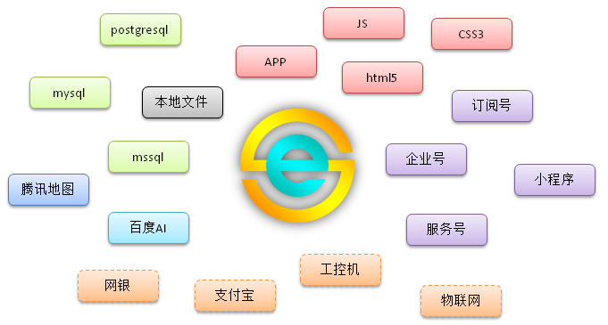

  

### ESAP·连接一切
ESAP服务器，村长亲自打造，集BAT技术精华于一身，致力于连接一切的酷炫梦幻产品!

### [>> 快速开始 <<](quickstart.md)

#### 重要通知
* esap云管理台地址：[http://admin.erp8.net](http://admin.erp8.net)

* 本文档为4.x版文档，3.x文档请前往:<a href="https://esap.vip/3.x/">3.x文档</a>2.x文档请前往:<a href="https://esap.vip/2.8/">2.8文档</a>

* 小程序通过ESAP与ES系统交互Demo全球首发：<a href="https://github.com/esap/miniapp">https://github.com/esap/miniapp</a>

* 技术讨论QQ群(ESAP-达摩院)：[365159025](http://shang.qq.com/wpa/qunwpa?idkey=130e97346aa11da4690999c9c91e3350e8673cb9c8fcf5df7c8f11d78ee73522) <<点击加入

##### ESAP安装工具
* <a href="./build/esap-cli.zip" download target="_blank">esap-cli</a>

##### ESAP令牌服务器
* <a href="./build/tokenserver.zip" download target="_blank">TokenServer</a>

##### ESAP机器人联盟 Hot! 

* <a href="./build/esap-wxbot.zip" download target="_blank">esap-wxbot</a> 微信机器人组件，支持个人号群聊

* <a href="./build/esap-qq.zip" download target="_blank">esap-qq</a> QQ机器人插件，支持cleverqq

* <a href="./build/esap-ydbot.zip" download target="_blank">esap-ydbot</a> [有度](https://youdu.im/)机器人组件
 
* <a href="./build/esap-feiq.zip" download target="_blank">esap-feiq</a> 飞秋机器人组件，仅支持文字查询

##### NAT工具
* <a href="./build/frp.zip" download target="_blank">FRP客户端版</a>

> 下载解压到任意文件夹，修改frpc.ini的`自定义`文字为自己的corpid，双击install.bat，即可穿透内网进行回调

> 回调地址示例：`http://wx123456789.erp8.net:8080/wx/esap`

##### 接口功能
|功能特性|服务号|企业号|钉钉|微信|QQ|飞秋|备注|
|:----:|:--:|:--:|:--:|:--:|:--:|:--:|:----|
|查询|√|√||√|√|√|订阅号部分接口可用|
|提醒|√|√||||||
|图表|√|√||||||
|图库|√|√||√|√|||
|定位|√|√||||||
|审批|√|√|√|||||
|打卡||√|√|||||
|短信|√|√||||||
|Email|√|√||||||
|计划任务|√|√||||||
|百度AI|√|√||√|√||身份证、发票、银行卡识别等|
|腾讯AI|√|√||√|√|||
|特性:多重select|√|√||√|√|√||
|特性:用mediaid|√|√|||||服务号可使用永久素材id|
|特性:返回文章|√|√||||||
|特性:分条返回|√|√||||||
|特性:系统变量|√|√||√|√|√|服务号需用本地通讯录，否则只有openid|

!> 注意：公众号需要认证过，接口回调必须使用`安全加密模式`！
#### 捐赠
维护这个项目需要大量时间和精力，如果它确实帮上了你的忙，不要忘了请村长喝杯茶哦 :)

  

**[捐赠玩家清单](donate.md)**

#### ESAP部落

村长微信 ↓↓↓

  

关注公众号，及时掌握最新动态 => ESAPbuluo ↓↓↓

  

#### 更新日志

##### v4.0 Justice!
2019年`七月`发布

* [新增]ESAP主程序新增任务检测，通过admin修改计划任务配置后，不再需要重启才生效。
* [新增]Tokenserver新增配置检测，修改tc.yml后不再需要重启。
* [新增]sql模板函数新增ES专属函数repcase(rcid,tmpname)
* [新增]修复图片文件get接口
* [调整]sql函数调整，与数据库相关函数最后一个参数可传dbname指定数据源。
* [新增]新版esap-cli会备份原有sql目录到sql.zip
* [修复]修复网盘目录不存在时文件存储失败的问题。
* [新增]新增`有度机器人`组件：esap-ydbot,适用于禁外网时使用有度IM进行ESAP查询。
* [修复]修复admin不能新建修改查询。
* [调整]取消内置AI菜单ID，全部使用模板查询。
* [新增]模板新增`mapset`,`time`,`rand`,`md5`函数，全面对接 **腾讯AI**.
* [新增]查询新增`退出`内置命令，可以退出连续查询.
* [新增]新增`飞秋机器人`组件：esap-feiQ.
* [新增]新增`微信机器人`组件：esap-wxbot.
* [新增]新增`QQ机器人`cleverqq插件：esap-qq.
* [新增]新增机器人API，复用微信查询，接口示例：`http://localhost:9090/robot/`
* [新增]4.0精简优化了大量细节，极大增强对web-api的对接能力，原生支持JU/NX，能同时对接包括并不限于百度云(sugar,AI)，腾讯云(微信公众号，QQ)，阿里云(钉钉，api市场)，更高更快更强！

##### v3.0 Strike!
2017年`七夕`发布

* [修复]修复企业微信用户超过100后，打卡记录下载不全的问题。
* [新增]微信查询新增新建表单模式，该模式会获取rcid，可用于后续连续查询。
* [新增]通讯录同步新增标签用户完全同步(增删改)。
* [新增]通讯录变量新增`别名`（{{别名}}）。
* [新增]通讯录同步新增自定义字段同步。
* [调整]通讯录englishname字段改为alias，与企业微信官方同步。
* [新增]图标API新增自定义模板chart1.html，可用于工资查询等流式布局的web页面返回显示。
* [新增]API日志新增用户名显示。
* [新增]新增关闭媒体库选项，可控制用户发送的图片、视频、音频库是否能上传存储。
* [新增]微信查询新增重启指令，key=`esapstart`，请注意设置应用权限，防止普通用户可操作。
* [修复]修复JUAP模式下通过admin上传的附件不能提醒的问题。
* [新增]名片识别新增`电话`，`传真`，`QQ`字段。玩家需求!
* [新增]新增对接腾讯AI，名片识别切换到腾讯AI。
* [新增]~~百度AI新增名片识别，key=`ocrbusinesscard`~~。
* [新增]esap-admin云管理台新增ES2JU图片附件转存工具。
* [新增]esap-admin云管理台上线，地址：[http://admin.erp8.net](http://admin.erp8.net) 重要调整!
* [新增]微信多媒体库(图，音，影)上传后，可以扫描二维码等做为描述，菜单key=`inputdesc`玩家需求!
* [调整]微信查询文件时不再显示物理路径，仅显示文件名。玩家需求!
* [调整]优化微信accessToken获取机制，加锁，降低API调用超限风险。
* [调整]优化数据库查询组件，优化日志显示，提高性能。
* [调整]整合AI类应用模板重命名为`ESAP_AI`，整合媒体类库模板重命名为`ESAP_多媒体库`。
* [新增]新增托盘图标，单独运行esap.exe时显示(nssm封装服务运行时不显示)。
* [新增]新增[聚表模式](juap.md)，导入`JUAP_提醒`模板即可，ESAP开始全面支持聚表对接企业微信。
* [新增]新增微信提醒后缀配置，可通过配置后缀实现基于自定义表的微信提醒。
* [调整]变更jwt认证方式，原url参数认证改为header认证(Authorization + Bearer)。
* [调整]esap-admin使用iview-admin作为基础架构。
* [新增]图表URL新增tmp参数，以便支持自定义html模板。例如，默认使用/view/chart.html模板，当tmp=1时，使用chart1.html模板。
* [修复]修复微信OA接口下载，原`ESAP_审批`模板拆分成`请假`，`报销`模板，并且所有脚本名称统一使用`模板名.wxsp`格式。
* [新增]新增百度AI车牌号识别、票据识别、营业执照识别和存入数据库。
* [修复]修复百度AI身份证识别国徽面图片存入异常。
* [新增]新增本地通讯录，统一鉴权接口，现在公众号也能像企业号一样鉴权了。重要调整!
* [新增]新增连续查询，用户通过设置“下一步”查询名称实现多个查询联动。玩家需求!
* [调整]配置多个应用时，如果配置了通讯录应用(agentId=9999999)，则其他同corpid应用不再需要根部门权限。
* [调整]admin模块调整脚本前缀位置。
* [新增]admin模块新增短信编辑和查询。
* [修复]修复加密信息，更新打卡记录下载机制(改为重复扫描一周内的记录)。
* [新增]新增短信提醒任务，连接腾讯云短信平台，扫描esap_sms表并发送短信。
* [新增]api新增jsapi接口，用于获取js-sdk配置，实现app扫码等native功能。
* [新增]admin模块新增任务测试按钮，可立即执行任务一次。
* [新增]自定义通讯录脚本前缀。
* [新增]自动/手动升级。
* [新增]微信查询支持语音和视频查询。
* [新增]新增`ESAP_语音`库和`ESAP_视频`库。
* [新增]微信查询新增图表查询，支持线，柱，饼图。玩家需求!
* [新增]新增图表API接口。
* [新增]微信查询新增参数路径。
* [调整]配置屏蔽空格。玩家需求!
* [新增]3.0采用全新的架构，实现了多应用，多数据库，多任务同时管理。现在人人都可以轻松打造微信应用服务云平台！

##### v2.8 freedom
发布于`2017-7-21`

* [新增]微信查询新增文章返回能力，当URL不为空时触发。
* [调整]微信自定义菜单扫描推事件改为绑定mkey了，即支持多种扫描推。
* [修复]修复微信查询事务导致仅返回前7条的bug。
* [调整]增加sqlt缓存，提升生产环境(debug=false)的API效率。
* [调整]admin模块必须使用ES系统管理员用户身份的账号登陆。
* [调整]admin模块增加分页显示，重启服务等功能，需先install服务。
* [新增]admin模块重构归来，整合配置管理，新增日志管理等功能，支持IE9+,Google Chrome等现代浏览器。
* [新增]微信提醒的pic和fh可以直接使用链接了，请修改字段长度以便更好的支持。
* [新增]update接口增加key=file上传。
* [修复]修复企业微信APP绑定失败的问题，secret需配置为APP应用的secret并添加可信域名。
* [新增]新增带用户日志的文件接口(/fl/:linkno)，用于用户下载文件记录。
* [新增]APP新增微信文库实用功能，开启企业流程制度移动查询新世界！
* [新增]新增redirect接口(/r/*)，用于转发URL。
* [新增]新增linkname模板函数，用于提取附件名。
* [新增]整合多种数据库驱动，支持多种数据库,例如：mssql,mysql,postgresql,sqlite,access,excel等，其中access,excel,sql2000不支持多重select！freedom!
* [新增]APP新增销售订单，采购订单，出入库单等实用功能。
* [新增]新增微信打卡（WxdkTask）同步计划。
* [新增]新增微信审批（WxspTask）同步计划，支持自定义模板，支持多图。cool!
* [新增]新增订阅服务号版，回调地址为/wxs，目前支持微信超级查询和图库功能。玩家需求!
* [新增]新增ES组织架构增量同步。玩家需求!
* [新增]新增agents配置项，可手工配置代理多个企业微信应用。
* [调整]微信专用查询(qname=agentId)隔离其他查询，菜单查询不受限制。
* [调整]微信查询默认使用打包模式。
* [新增]微信查询新增safe字段，控制回复是否使用保密消息。玩家需求!
* [新增]新增dbport配置，用于配置数据库端口。
* [新增]兼容企业微信，新增文本卡片消息，仅使用企业微信时有颜色效果（灰色(gray)、高亮(highlight)、默认黑色(normal)）。
* [新增]微信查询的结果无字段名称时，将省略名称和冒号，实现更灵活的输出。
* [新增]微信查询进入提醒可写sql，实现灵活的提醒功能，需配置showfunclistenter=true。玩家需求!
* [调整]更换数据库驱动，全面支持多重select查询新特性，数据库要求sql2005+！ 重大调整!
* [新增]新增微信会话回调（/wxchat），可存储企业号会话消息。玩家需求!
* [新增]新增es2/*接口，带错误输出(errmsg)和结果输出(output)以及工作台显示。玩家需求!。
* [新增]新增api2/*接口，带错误输出(errmsg)和结果输出(output)。玩家需求!
* [新增]app新增ES绑定账号。
* [新增]微信办理增加多帐套支持，wxtx,wxcx表加入了db字段，填入对应数据库名称即可。玩家需求!
* [新增]集成nssm和一键安装，卸载自动化批处理文件。
* [新增]sql模板新增uuid函数，用来产生不重复全局唯一ID。
* [调整]调整api/*接口，post/put/delete自带事务。
* [调整]配置文件格式调整为yaml，名称调整为esap.yml。解决配置(如密码)中包`'`号等特殊字符不识别问题。
* [修复]更新wxtx.tpl，修复微信提醒加入top1000后不能发提醒的bug。

##### v2.7 destiny
发布于`2017-5-9`

* [新增]新增WxqdTitle配置项，用于配置微信签到显示标题。
* [新增]新增upload接口，用于上传图片文件。
* [新增]微信查询新增P参数(大写)，表示输入的所有内容。
* [新增]新增计划任务模块(全新的玩法，更多的脑洞)；玩家需求!
* [新增]微信查询新增多重返回，可以一次写多个select，保证返回的字段数量一致即可；
* [新增]新增若干开关，可手工更改配置文件进行调整；
* [新增]微信查询新增默认应用支持(全新的玩法，更多的脑洞)；玩家需求!
* [新增]新增log模块，运行日志写入esap.log文件，~~上次日志存入日志备份(esap.log.bak)~~，当配置Debug=false时，将不再打印sql模板相关信息，可大幅减小日志文件体积；
* [新增]微信提醒增加重发机制(配置文件ReTryMsg=true)，海外用户应用时更稳定；玩家需求!
* [新增]微信提醒“部门/职位”格式的接收人支持；玩家需求!
* [调整]微信提醒接收人填报更自由，可使用姓名，账号，手机号，~~微信号，邮箱，~~职位，部门任意组合搭配；
* [新增]支持保密消息(safe=1)；玩家需求!
* [新增]ESWEB待办事宜列表打开；
* [新增]超级查询新增用户进入时显示可用查询列表(配置ShowFuncListEnter=true)，企业号端需开启`上报用户进入`，此外配置文件ShowFuncList=true时，查询中未匹配任何功能也会返回可用查询列表；
* [新增]超级查询新增ES表单搜索查看功能；
* [新增]超级查询增加打包回复模式，解决消息内容过多时的乱序问题（mediaOnly=3）；
* [新增]HOST配置支持端口，可以与监听端口(例如9090)不一致，更方便外网NAT；
* [新增]微信权限支持自定义角色权限支持；
* [新增]esmail自定义发件人支持,可不使用系统Email账户,但与系统Email共用smtp服务器设置；玩家需求!
* [调整]调整微信提醒，邮件提醒，使用计划任务进行配置；
* [调整]调整微信反馈，增加附件上传与回复；
* [调整]超级查询优化消息机制，改善网络延迟造成的重发问题；
* [调整]采用vux重写app；
* [调整]采用sqlt重写esmail插件、微信提醒插件、超级查询和api模块等，支持自定义sql模板；
* [调整]取消`微信通讯录`模板，改为服务器缓存，解决重名和同步等烦恼；
* [调整]重构ESAP主容器，采用模块化+插件化架构，适应大规模开发定制应用；
* [修复]中文消息超过500字时拆分出空消息的bug；

##### v2.5 里程碑
发布于`2017-3-8`

* [新增]新增微信签到，支持地图显示，支持菜单按钮签到；
* [新增]新增微信图库，通过相册或拍摄照片上传，支持多图上传；
* [新增]新增微信反馈，通过APP进行反馈提交；
* [新增]微信提醒新增图片、文件消息支持；
* [新增]微信提醒新增多人多部门消息支持；
* [新增]微信提醒新增密图文消息支持，支持多条密图文；
* [新增]微信提醒新增普通新闻消息支持，支持多条普通新闻；
* [新增]微信超级查询新增回写支持，支持update,insert；
* [新增]微信超级查询新增通讯录变量支持，增加任意标点分割功能；
* [新增]微信超级查询新增多选混合权限支持；
* [新增]微信超级查询新增任意应用回调支持；
* [新增]微信超级查询新增扫码(二维码/条码)查询支持；
* [新增]微信超级查询新增图片，附件查询支持；
* [新增]微信超级查询新增OCR接口；
* [新增]微信超级查询增加自动拆分消息功能(500字)；
* [新增]微信超级查询增加填报功能； plus!
* [新增]增强办理链接加密级别； plus!
* [新增]增强微信图库兼容级别； plus!
* [调整]采用echo框架重构公共库。
* [修复]超级查询随机排序问题；

##### v2.4 plus
发布于`2017-2-4`

* [新增]新增微信超级查询引擎；
* [新增]新增API主机(Host),ESweb主机配置项；
* [新增]新增工作流办理； plus!
* [调整]采用重构版微信SDK。 plus!

##### v2.3
发布于`2017-1-18`

* [新增]新增微信提醒标题配置项；  
* [新增]新增邮件提醒功能，可带图片、附件；  
* [修复]高版本网盘系统表切换问题。

##### v2.2
发布于`2017-1-13`

* 简化配置项，增加配置页面/conf；  
* 更新大量细节，模块运行更稳定；
* 错误提示完善，不再因普通错误导致崩溃；  
* 现在你只需要两步就可以玩转微信提醒： **1、导入模板；2、启动esap.exe** 就是这么简单！

##### v2.1
发布于`2017-1-7`

* 修复BOM复制本表代码；  
* 更新vBOM、vPBOM视图，修复子件超过10个的RN排序问题；  
* 导入微信提醒、~~微信通讯录、微信提醒视图(vwxtx)~~；    
* 增加微信企业号API及基本配置； 

##### v2.0 
发布于`2017-1-5`

* 导入主数据：商品、企业、字典；  
* 导入IO单对象、订单对象；  
* 导入无级BOM；  
* 导入自动检查更新功能(ESAP_关于)。
