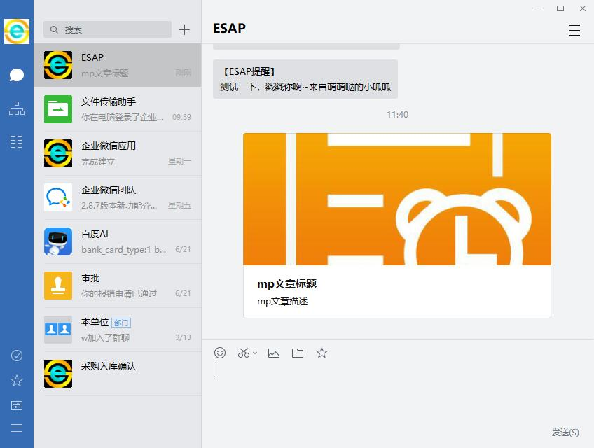

# 第7章 微信全垒打

- [如何发消息给全体](#如何发消息给全体)

- [如何发消息给用户组](#如何发消息给用户组)

- [如何发图片或文件消息](#如何发图片或文件消息)

- [如何发密图文消息](#如何发密图文消息)

- [如何发普通图文消息](#如何发普通图文消息)

- [如何发待办提醒](#如何发待办提醒)

- [如何微信办理工作流](#如何微信办理工作流)

- [如何微信签到](#如何微信签到)

- [如何使用微信图库](#如何使用微信图库)

## 申请微信企业号
* 首先到微信公众平台申请企业号：[https://mp.weixin.qq.com/](https://mp.weixin.qq.com/)

## 设置管理权限
* 登陆你申请好的企业号，进入【设置】--【权限管理】--【新建普通管理组】

* 接下来对该管理组设置：【设置管理员】

* 接下来对该管理组设置：【设置应用权限】-【勾选企业小助手】

* 同时设置【通讯录权限】-【勾选所有成员的管理权】

* 记录下 **【CorpID】** 和 **【Secret】** ，这两个参数在后面会用到。


## 下载微信模板和ESAP服务器程序
* 从项目首页：[https://erp8.net/esap/](./README.md)下载最新的模板以及程序，可选择x86或x64版本。

## 导入模板
* 解压下载的<a href="./db/wechat_tmp.rar" target="_blank">wechat_tmp.rar</a>，将其中`【微信提醒】`模板导入你的ES应用中。

## 启动API
* 双击esap.exe启动即可,首次启动后会自动进入配置界面，默认是:[localhost:9090/conf](https://localhost:9090/conf)


## 关于EncodingAesKey
可以从企业号进入`【企业小助手】`，设置回调模式的界面获取。


## 创建微信提醒消息
* 在创建消息前请先确保企业号的通信录已经导入到ES的【微信通讯录】中。


* 在ES中新建一条【微信提醒】记录，也可以回写新建，例如像这样：


* 最迟一分钟后，你将收到来自微信企业号的提醒内容。


> esap2.5+版本可以通过设置`cDate`来推迟消息的发送。

## 如何发消息给全体
* 在【ES微信通讯录】加个特别用户，账号为@all，姓名随意，例如`全体`。


 
* 新建提醒，姓名填`全体`。


## 如何发消息给用户组
在ES微信通讯录加些特别用户，账号为 **多个员工账号，用`|`隔开** ，例如`nana|w|gg`，姓名随意，例如`管理层`。


> esap2.5+支持逗号隔开的多个接收人或部门。


## 如何发图片或文件消息
当`pic`字段或`fh`字段 **有值** 时，系统自动发送。


> 该功能esap2.5+支持，需要在网盘所在服务器上运行，或将网盘根目录映射到本地(盘符一致)。

## 如何发密图文消息
当wxtxd表中有值时自动发送，`pic`，`title`，`content`字段必填。





> 该功能esap2.5+支持

## 如何发普通图文消息
当wxtxd表`pic`字段无值，`title`，`digest`,`content`,`url`字段有值时自动降级为普通图文消息。


> 该功能esap2.5+支持

## 如何发待办提醒
* 在ES系统的ES_Witodo表上加上下列触发器即可

* 注意，**`ES系统用户名要跟ES微信通讯录的姓名一致`**


```sql
USE [esapp1] --改成你自己的数据库
GO

/****** Object:  Trigger [dbo].[tWxtx]    Script Date: 02/04/2017 22:13:12 ******/
SET ANSI_NULLS ON
GO

SET QUOTED_IDENTIFIER ON
GO

-- =============================================
-- Author:        woylin
-- Create date: 2017-2-15
-- Description:    esap ver2.5
-- =============================================
CREATE TRIGGER [dbo].[tWxtx] 
   ON  [dbo].[ES_Witodo] 
   AFTER INSERT
AS 
BEGIN    
    SET NOCOUNT ON;    
    insert wxtx(cdate, toUser, toAgent, content, usr, wi) 
    select getdate(), UserName, 0, f.pName + wiDesc, u.UserLogin, wi.wiId
    from ES_WorkItem wi, ES_User u, inserted i, ES_WfTask t,ES_WorkFlow f
    where wi.wiId=i.wiId and i.userId=u.UserId and wi.tId=t.tId and t.pId=f.pId
    and isnull(wi.wiDesc,'')<>''
END
GO
```

效果图：


## 如何微信办理工作流
* 导入2.4+的`微信提醒`模板；
* 确保你的esweb能够正常访问，工作流模板勾选了网页填报。
* 配置了`Host`参数为外网可用域名或IP，`EsWeb`参数为内网esweb服务器根url；
* 配置esweb根目录的web.config文件的`RequestMainURL`键值为`http://HostIP或域名:端口/wi`

例如：
```
<add key="RequestMainURL" value="http://io.erp8.net:9090/wi/" />
```

* 修改Esweb\main\Framemain.aspx，head下增加一个<meta>标签，以便适应移动访问，内容如下：

```
<meta name="viewport" content="width=device-width,initial-scale=1">
```

效果图：


## 如何微信签到
开启`企业小助手`回调并勾选`上报地理位置`。


* 导入esap2.5+的`微信签到`模板；
* 用户进入小助手时，允许上报地理位置；
* 直接回复`签到`即可，签到信息同步到ES签到模板。

效果图：


* 也可以设置一个自定义按钮,key为`wxqd`。


> esap2.5+支持

## 如何使用微信图库
* 导入esap2.5+的`微信图库`模板；
* 进入`企业小助手`选择相册或拍摄，再填入照片描述即可。


> esap2.5+支持

## 移植可行性
ESAP服务器直接与MSSQL交互，使用MSSQL的程序或系统都可以移植，包括并不限于下列项目：

+ 勤哲Excel服务器
+ 冠日网络Excel平台
+ 金蝶
+ 用友
+ 速达
+ SAP
+ FineReport
+ 快表
+ 云表

## 移植到Excel服务器

* 如果你使用的是9.4+版，恭喜你，只需要将wechat_tmp中的`微信模板`导入到你的生产应用中，然后启动esap服务器即可。

* 如果是es9.4以下版本，例如7.1.7，8.4，9.2等，则需要自行建立这些`微信模板`，并保证表名和字段名一致即可。

## 配合其他平台或ERP系统

* 只要是使用MSSQL，都可以自行建立这些`微信模板`的数据表，并保证名称类型一致即可。

## 开启Debug模式
* 配置文件EsConf看起来是这样：

```json
{
	"UserId" 		 : "sa",	// 数据库用户名
	"Pwd"	 		 : "123",	// 数据库密码
	"Server" 		 : ".",	// 数据库服务器，本机可以只填个.，支持自定义实例端口，示例：192.168.1.10/实例名,端口
	"DbName" 		 : "esapp1",	// 应用数据库，可以改成esapp1
	"Token"          : "esap",					
	"CorpId"         : "你的企业号CorpId",	// 企业号CorpID
	"Secret"         : "你的管理组Secret",	// 企业号管理组Secret
	"EncodingAesKey" : "45KgeiWtLf6lgU6TXq4lFKJvS2gNxCjFK4niyNewhYb",
	"Port"           : ":9090",	// API端口号
	"WxtxDuration"	 : 1,	// 提醒扫描间隔(分钟)，填0则不扫描
	"WxtxTitle"		 : "【ESAP提醒】",	// 微信提醒标题
	"Esweb"		  	 : "http://192.168.99.33",	// ESweb服务器内网IIS主机
	"Host"		     : "app.erp8.net",	// ESAP内网IP或外网IP(域名)
	"Debug" 		 : true	// 手工加入该参数重启ESAP即可打印调试信息
}
```

>注意，最好用Notepad++或者sublime等文本编辑器，不要用windows的记事本编辑，可能会导致无法读取配置

## 其它问题或开发需求
* 您可以加入ESAP部落，到QQ群中与大家一起讨论吧：[275205931](http://shang.qq.com/wpa/qunwpa?idkey=8065d28ea0b39649052de5d2aeab377014d268a5a9fa7463d4873b205233aaff) <<点击加入

* 注意：为了创造更好的交流环境，本群设置了收费进入，适当提高门槛以防止广告及闲杂人员进入。