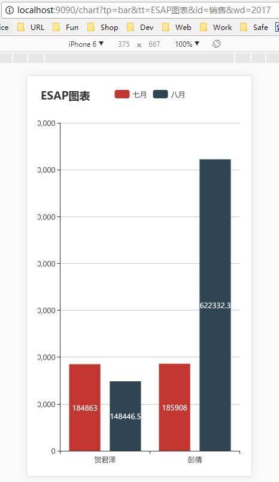
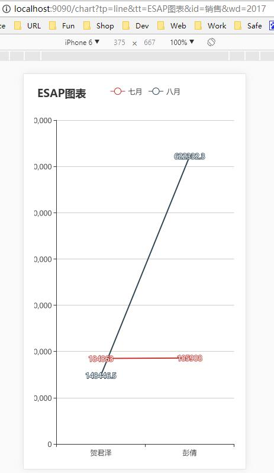
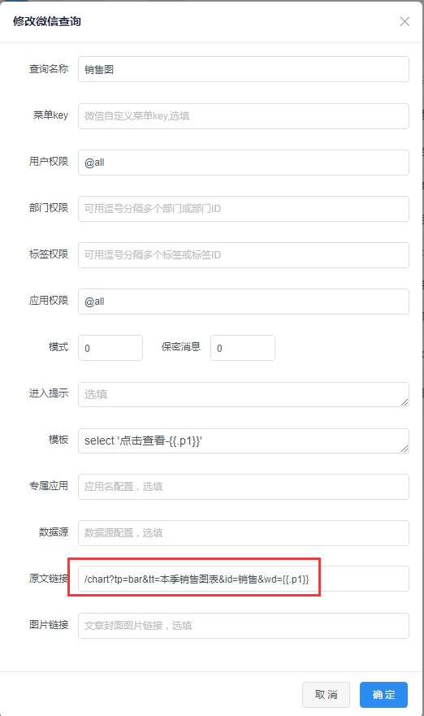
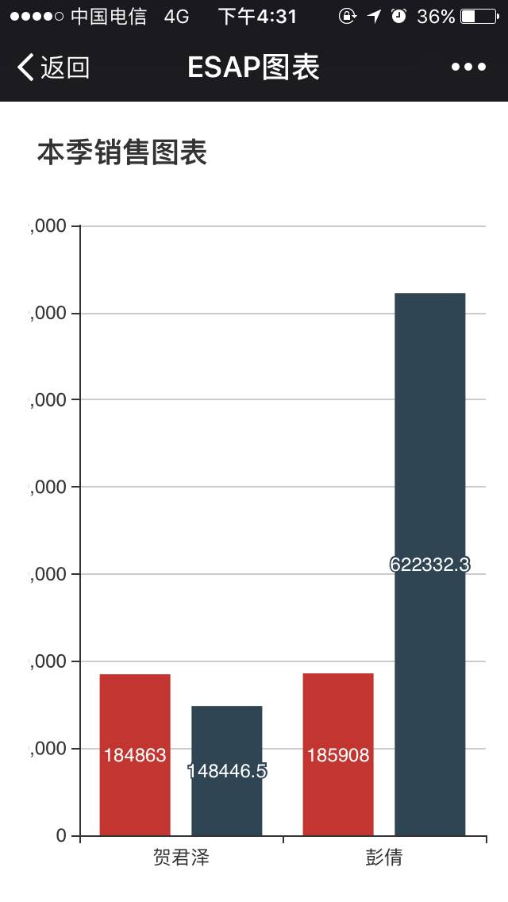

# 图表API
* 从3.0版开始，ESAP引入了图表API,采用百度的EChart库[http://echarts.baidu.com/index.html](http://echarts.baidu.com/index.html)。

* 图表API是在数据API的基础上进行了可视化，相关基础知识可参考[数据API](sqltpl.md)。

## 如何使用
* 图表API的完整访问地址为
	`http://host/chart?tp=图表类型&tt=标题&id=模板ID&wd=查询条件&y=0`。

|参数|含义|是否必填|可选值|
|:----:|:--:|:--:|:----|
|tp|图表类型|否|line,bar,pie(线，柱，饼)|
|tt|图表标题|否||
|id|模板ID|是||
|wd|查询条件|否|跟微信查询一样，逗号或空格分隔|
|y|分类转置|否|=1时分类显示在Y轴|

## 使用示例
* 首先需要在sql/chart目录下建立后缀为.get的sql模板，例如建立一个`sales.get`，示例代码如下：

```
{ {define "销售"} }
select 制单, sum(ISNULL(应收合计,0)) 七月 from 内销 --系列1
where year(交货日期)={ {.p0} } and month(交货日期)=7
group by 制单

select 制单, sum(ISNULL(应收合计,0)) 八月 from 内销 --系列2
where year(交货日期)={ {.p0} } and month(交货日期)=8
group by 制单
{ {end} }
```

* 示例定义了一个名为`销售`的sql模板，用来查询七、八月的销售业绩，其中有一个`p0`参数用来区分年份，当我们访问http://host/chart?tp=bar&tt=ESAP图表&id=销售&wd=2017时就可以看到下列图表。



* 可以更改图表类型，例如把tp改成`line`,然后刷新即可看到下面的折线图。



## *微信查询图表[高级教程]

* 配置一个微信查询，原文链接使用参数路径，注意这里传入的是`p1`，示例如下。



* 在微信中输入`销售图 2017`，可返回图表，点击查看即可。





