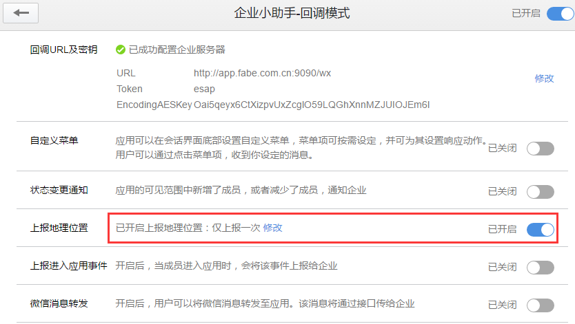
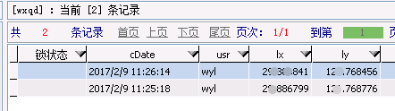
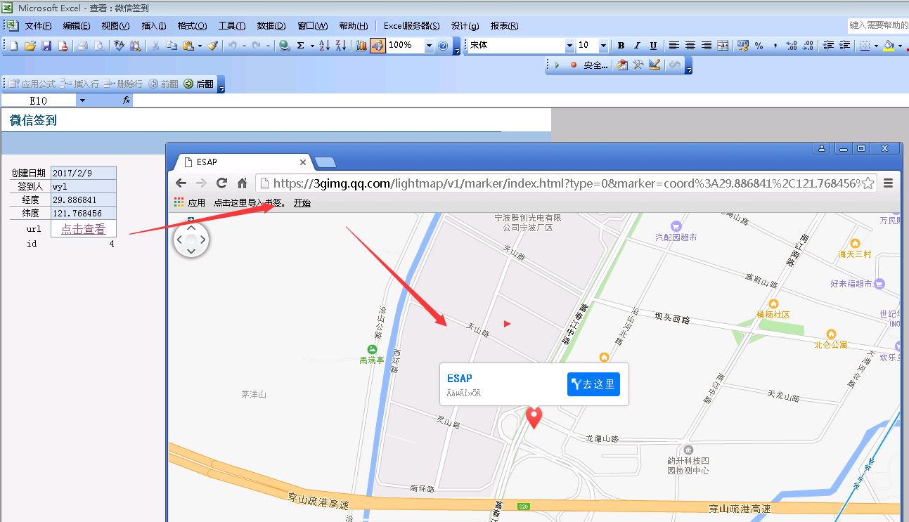

# 增强功能
ESAP增强了ES系统功能，以便ES更好的服务于企业。

* [邮件接口](#邮件接口)
* [微信签到跟踪](#微信签到跟踪)
* [微信图库](#微信图库)

## 邮件接口

ESAP实现了自己的邮件接口，可以加入图片或附件,发给多人时使用分号(;)或逗号(,)分隔。

2.7+可使用自定义的发件人，但发件人应与系统邮件发件人是同一个域，即smtp服务器设置相同。

效果图：

* 使用前提：
 * 依赖`esap_mail`表。
 * 1.开启网盘并设置了系统网盘；
 * 2.开启了邮件通知并设置邮件服务器。

## 微信签到跟踪
开启应用回调并勾选`上报地理位置`。

* 依赖`esap_qd`表；
* 用户进入微信应用时，允许上报地理位置；
* 用户处于应用中时，会不断记录其位置。

效果图：

## 微信图库
* 依赖`esap_tk`表；
* 进入微信应用选择相册或拍摄，再填入照片描述即可。
* 支持连续发送多个图片，再填入该组图片描述。

