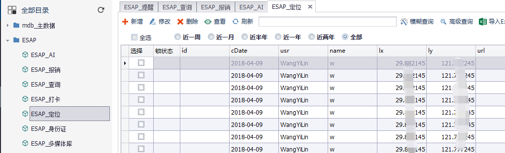

# 增强功能
ESAP增强了ES系统功能，以便ES更好的服务于企业。

## 邮件接口

ESAP实现了自己的邮件接口，可以加入图片或附件,发给多人时使用分号`;`或逗号`,`分隔。

> 2.7+可使用自定义的发件人，但发件人应与系统邮件发件人是同一个域，即smtp服务器设置相同。

效果图：

* 使用前提：
 * 依赖`esap_mail`表。
 * 1.`开启`网盘并设置了`系统网盘`；
 * 2.`开启`了邮件通知并`设置邮件服务器`。

 * 3.如果是聚表模式`(JUAP)`，需要到`ESAP_设置`模板中设置邮件服务器。

## 微信定位
开启应用回调并勾选`上报地理位置`。

* 依赖`esap_dw`表；
* 用户进入微信应用时，`允许上报地理位置`；
* 用户处于应用中时，会不断记录其位置。

效果图：

