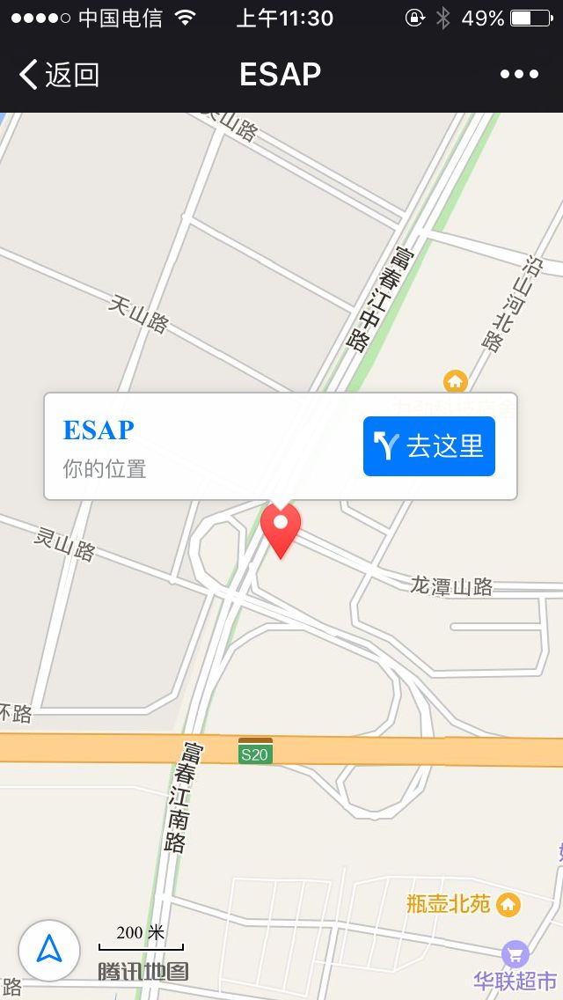
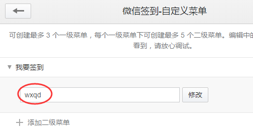
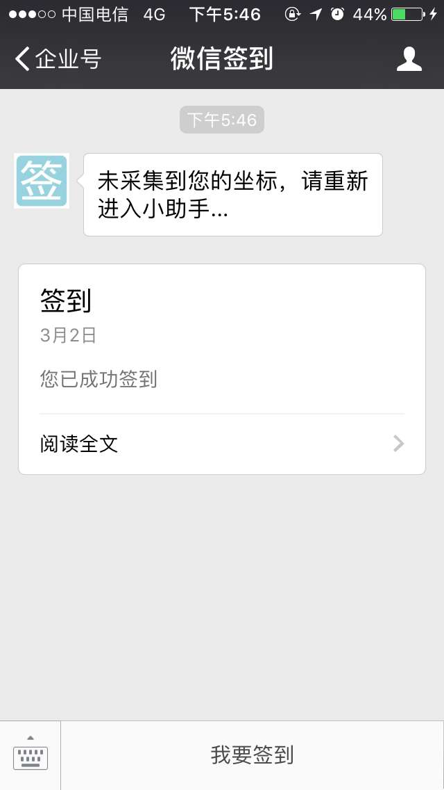

# 增强功能
ESAP增强了ES系统功能，以便ES更好的服务于企业。

* [邮件接口](#邮件接口)
* [微信办理](#微信办理)
* [微信签到](#微信签到)
* [微信图库](#微信图库)

## 邮件接口

ESAP实现了自己的邮件接口，可以加入图片或附件,发给多人时使用分号(;)或逗号(,)分隔。


2.7+可使用自定义的发件人，但发件人应与系统邮件发件人是同一个域，即smtp服务器设置相同。


效果图：


* 使用前提：
 * 依赖`email` 模板。
 * 1.开启网盘并设置了系统网盘；
 * 2.开启了邮件通知并设置邮件服务器。


## 微信办理
ESAP对微信提醒进行了工作流增强，可直接通过微信提醒办理ES待办事宜。

* 导入`微信提醒`模板；
* 确保你的Esweb能够正常访问，工作流模板勾选了网页填报。
* 配置了`Host`参数为外网可用域名或IP，`EsWeb`参数为可访问的esweb的url(最后面不要有斜杠)；
* 配置Esweb根目录的web.config文件的`RequestMainURL`键值为`http://HostIP或域名:ESAP端口/wi`(最后面不要有斜杠)
* IOS系统版微信可以直接点击打开办理，安卓版微信内置浏览器不支持ESWEB，需要选择用原生浏览器打开。

例如：
```
<add key="RequestMainURL" value="http://io.erp8.net:9090/wi" />
```

* 建议修改Esweb\main\Framemain.aspx，head下增加一个<meta>标签，以便适应移动访问，内容如下：

```
<meta name="viewport" content="width=device-width,initial-scale=1">
```

效果图：


> 2.4+

## 微信签到
开启`企业小助手`回调并勾选`上报地理位置`。


* 依赖`微信签到`模板；
* 用户进入小助手时，允许上报地理位置；
* 直接回复`签到`即可，签到信息同步到ES签到模板。

效果图：





* 也可以设置一个key为`wxqd`的自定义按钮。




> 2.5+

## 微信图库
* 依赖`微信图库`模板；
* 进入`企业小助手`选择相册或拍摄，再填入照片描述即可。
* 支持连续发送多个图片，再填入该组图片描述。


> 2.5+
