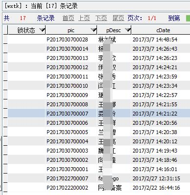
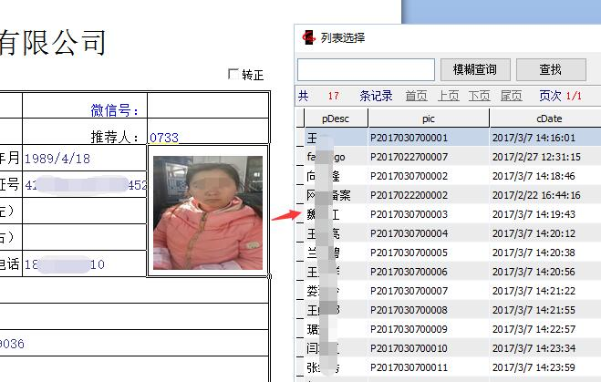
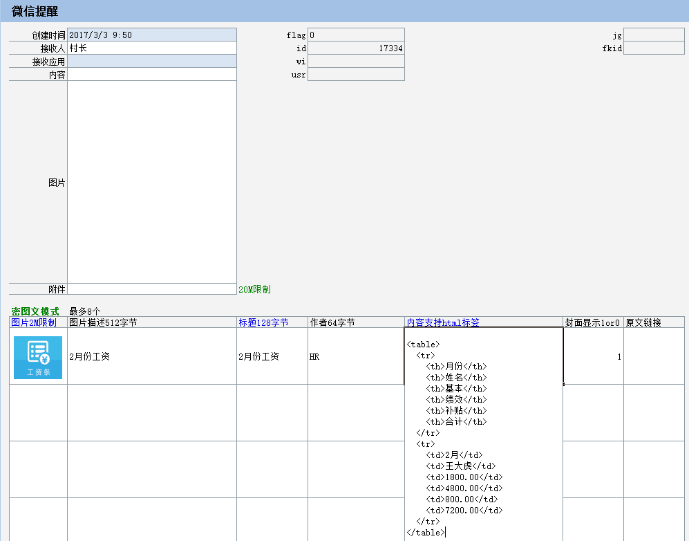
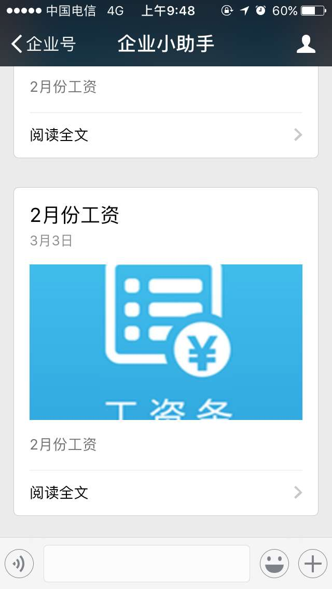
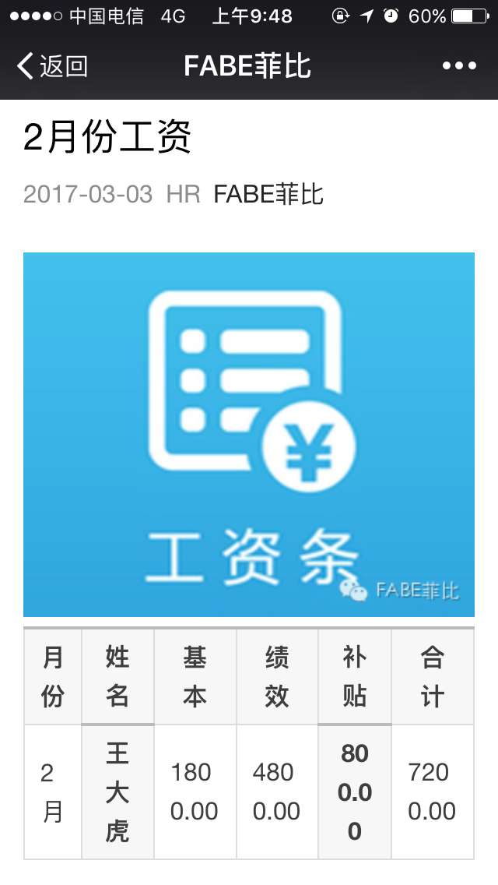
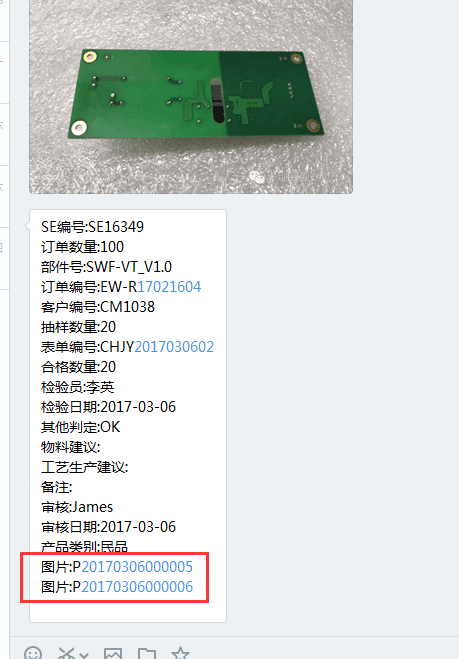
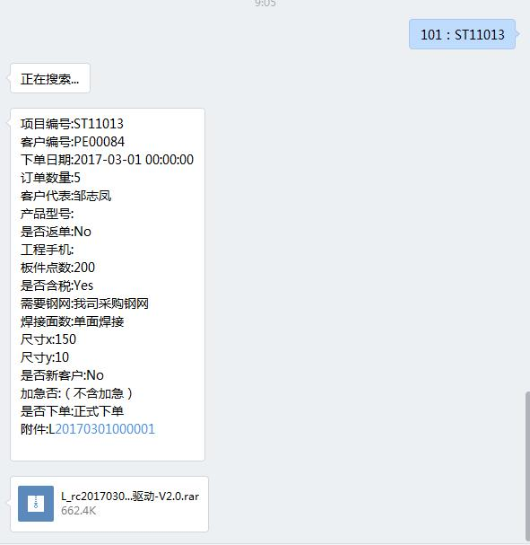
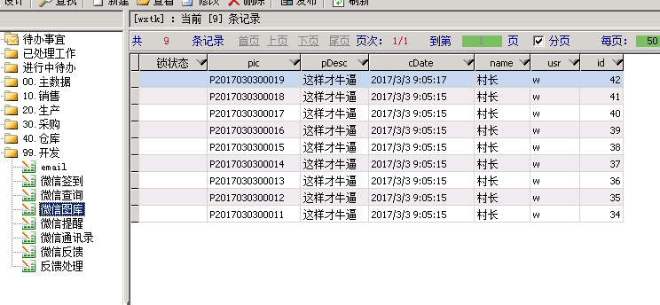
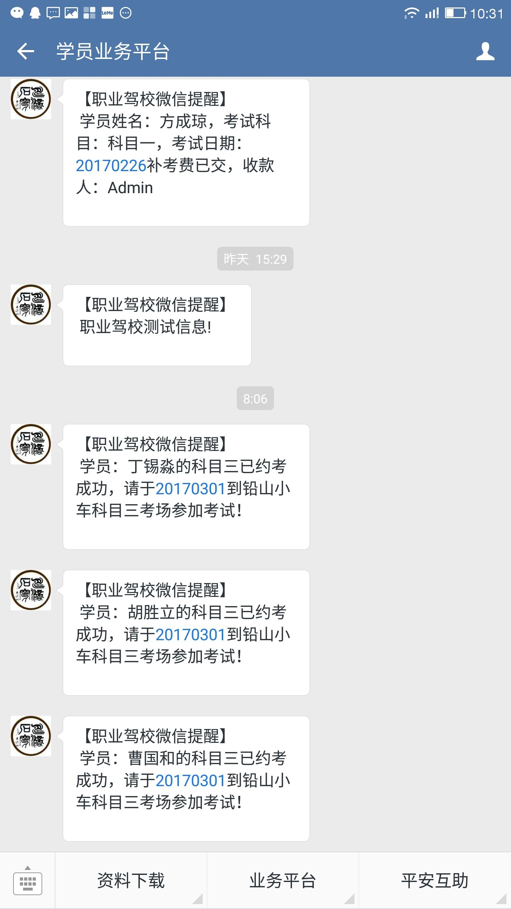

# 玩家秀

## 人事照片采集
* 创建`图库列表规范`，在员工表照片字段使用规范；
* HR使用微信图库功能，现场直接拍照上传ES；
* 回到办公室，修改员工表选择刚刚拍好的图库即可，cool!

## 工资条通知

## 产品检验查询

> @木头

## 给客户发出货通知

> @木头

## 产品订单查询

> @木头

## 批量上传图片

## 驾校通知应用

> @老兵