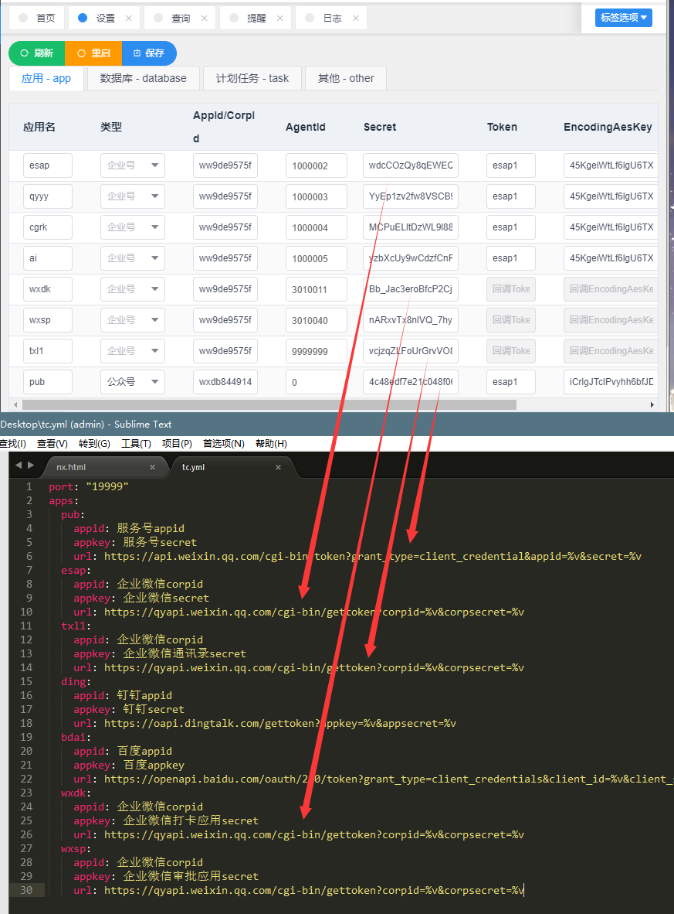
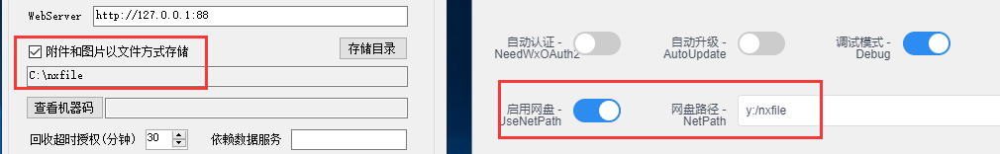
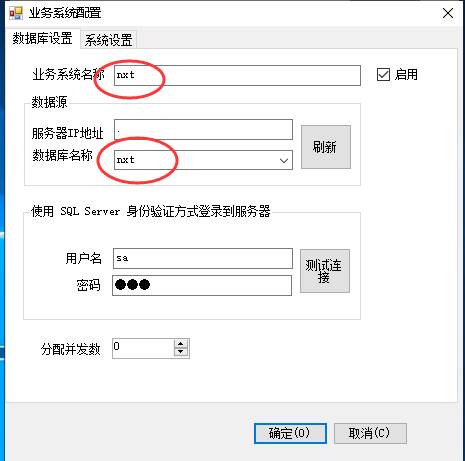
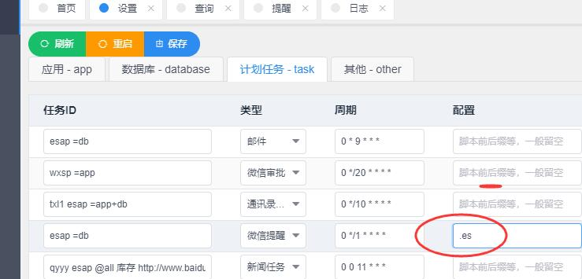

# 新版区别

ESAP从4.0.0版开始原生支持JU/NX聚表/慧表平台，其他变化如下：

## 配置变化

部分配置项改名或取消，如果配置了tokenserver，需要在tc.yml中注册所有开启的应用项

## 原生支持JU/NX

请注意开启网盘，并配置好esap里的网盘路径(可以映射网络驱动器)

并且应用需要跟数据库名一致

这也意味着ES不再受原生支持，部分任务可能需要加入`.es`后缀，例如：提醒，邮件

## sql模板参数统一为{{.pn}}

不再支持`:pn`形式，所有参数包括sql/sys/*中的模板以及微信查询esap_cx表中的模板都需要改为{{.pn}}模式

## 表字段变化

提醒表esap_tx增加了msgtype,msgid,description字段

查询表esap_cx增加了appid和tmpid字段