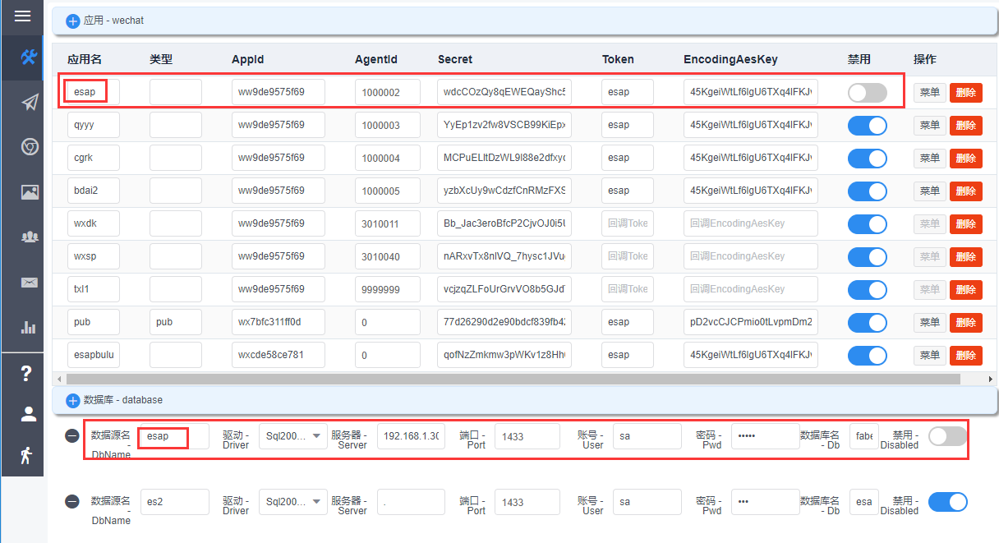

# 快速开始

* [申请企业微信](#申请企业微信)
* [设置企业应用](#设置企业应用)
* [下载安装升级工具](#下载安装升级工具)
* [启动服务配置](#启动服务配置)
 - [首次配置](#首次配置)
 - [非首次配置](#非首次配置)
* [更改高级配置](#更改高级配置)

## 申请企业微信
* 首先到企业微信官网申请账号：[https://work.weixin.qq.com/](https://work.weixin.qq.com/)

## 设置企业应用
* 登陆企业微信,进入【我的企业】，记录下`CorpID`


* 进入【企业应用】--【创建应用】,进入该应用记录下`AgentId`和`Secret`


* 点击【接收消息】--【启动API】，可进入`回调界面`，暂停企业微信的设置，准备安装ESAP。

> 回调URL设置参见[微信查询篇章](wxcx.md)

## 下载安装升级工具
* 从ESAP官方首页：[https://erp8.net/esap/](./README.md)下载esap-cli工具。

* 解压工具包，将其中的esap-cli.exe拷贝到需要安装（升级）esap的目录中，双击运行。


* esap-cli工具会自动检索下载最新版的esap并安装服务。

> 如果使用ES系统，需将其中`【ESAP_提醒】`模板导入到你的ES应用中，模板导入时可能会提示公式或规范出错，请无视

## 启动服务配置
* 双击install.bat安装服务启动esap服务后台（使用esap-cli工具会自动执行此步）。

> 注意，安装前请关闭360等软件，防止服务安装失败

* 首次进入配置界面:[localhost:9090/admin](http://localhost:9090/admin)，账号：**admin**，密码：**erp8**

#### 首次配置
* 设置一个名为`esap`的微信主应用(必须)，建议企业号，完整填入其他参数（appid填前面申请的企业号corpid，AgentId和Secret填前面记下的，Token和EncodingAesKey可以使用示例配置也可以自己在回调界面生成，须一致），然后打开“开关”。

> 可设置多个其他应用，应用名自拟唯一，若是公众号，类型填入pub，打开“开关”。

* 设置一个名为`esap`的主数据库(必须，建议sql2005+)，若是ES建库，可导入ES模板，打开“开关”。

> 可设置多个其他数据库，数据源名自拟唯一，打开“开关”。



<span style="color:red">注意：先保存ESAP配置，重启服务生效后再尝试保存企业微信应用的回调配置!</span>

#### 非首次配置
直接使用esap-cli升级即可。

## 更改高级配置

* 配置esap.yml可用[Notepad++](https://www.baidu.com/s?wd=notepadd%2B%2B)手工编辑，可开启一些高级配置。

```yaml
staticpath: #静态文件目录
- static
- upload
logpath: log/ #日志路径
uploadpath: D:\esap-cli-x64/upload #默认上传路径
host: io.erp8.net:9090 #外网网址，阿里云可直接用IP，企业内网要做NAT
port: "9090" #监听端口
pwd: 777c43f12c5bd3f40d86b4fdf549e1f8 #管理台密码，md5，默认：erp8
syncdelay: 200 #通讯录同步延时，最小100(毫秒)
ises: true #使用ES应用库时设置true
retrymsg: false #微信提醒失败重发开关，为true时开启
entermsg: false #用户进入时显示可用列表开关，为true时开启
needwxoauth2: false #进入app时自动认证身份(定制)
debug: true #调试模式开关，为true时开启，log中输出调试详情
```

> 注意，不要用windows的记事本编辑，可能会导致无法读取配置

**常用配置可以通过admin模块可视化管理，建议使用google chrome浏览器和sql2005+**
