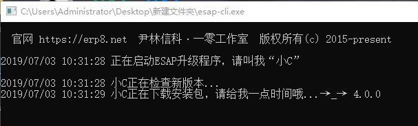
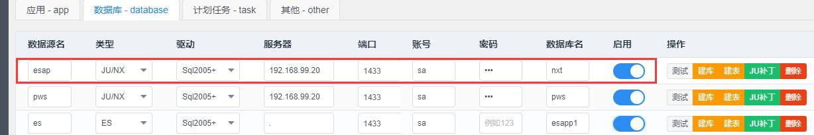

# 快速开始

## 申请企业微信

* 首先到企业微信官网申请账号：[https://work.weixin.qq.com/](https://work.weixin.qq.com/)

## 设置企业应用

* 登陆企业微信,进入【我的企业】，记录下`CorpID`


* 进入【企业应用】--【创建应用】,进入该应用记录下`AgentId`和`Secret`


* 点击【接收消息】--【设置API接收】，可进入`回调界面`，暂停企业微信的设置，准备安装ESAP。

> 回调URL设置参见[微信查询篇章](wxcx.md)

## 下载esap-cli工具

* 从ESAP官方首页：[https://esap.vip](https://esap.vip)下载`<a href="./build/esap-cli.zip" download target="_blank">esap-cli</a>`工具。

* 解压工具包，将其中的esap-cli.exe拷贝到需要`安装(升级)`esap的目录中，双击运行。



* esap-cli工具会自动检索下载最新版的esap并安装服务。

!> 注意，安装前请关闭360等软件，并关闭windows防火墙，防止服务安装失败

## 启动服务配置

* 访问配置页面:[http://admin.erp8.net](http://admin.erp8.net)，账号：`localhost:9090`，密码：`erp8`

#### 首次配置

* 设置应用名为`esap`的微信主应用(必须)，建议企业微信，完善参数填前面申请得到的:`appid`，`AgentId`和`Secret`，Token和EncodingAesKey可以不改，然后`启用`，保存重启。


> 多应用，应用名唯一，如果是企业微信还需要配置启用`通讯录应用`(`txl1`)

* 设置数据源名为`esap`的主数据库(必须，`sql2005+`)，若是JU/NX/ES建库，可导入模板，否则请点击建表，创建必要的系统表，然后`启用`，保存重启。



> 多数据库，数据源名唯一

!> 注意：先保存ESAP配置，重启服务生效后再尝试保存企业微信应用的回调配置!

#### 非首次配置

直接使用esap-cli升级即可。

## 更改高级配置

* 配置esap.yml可用[Notepad++](https://www.baidu.com/s?wd=notepadd%2B%2B)手工编辑，可开启一些高级配置。

```yaml
staticpath: #静态文件目录
- static
logpath: log/ #日志路径
uploadpath: D:\esap-cli-x64/upload #默认上传路径
host: demo.erp8.net:9090 #外网网址，阿里云可直接用IP，企业内网要做NAT
port: "9090" #监听端口
pwd: 777c43f12c5bd3f40d86b4fdf549e1f8 #管理台密码，md5，默认：erp8
syncdelay: 200 #通讯录同步延时，最小100(毫秒)
retrymsg: false #微信提醒失败重发开关，为true时开启
tokenserver: http://erp8.net:19999 #口令服务器
usenetpath: true #开启网盘
netpath: y:/nxfile #网盘路径
entermsg: false #用户进入时显示可用列表开关，为true时开启
needwxoauth2: false #进入app时自动认证身份(定制)
debug: true #调试模式开关，为true时开启，log中输出调试详情
apps:
- appname: esap #esap主应用
  appid: ww9de9575f693a9419
  agentid: 1000002
  token: esap1
  secret: wdcCOzQy8qEWEQayShc59UxPggleUn5vBD2DRgcHuwA
  encodingaeskey: 45KgeiWtLf6lgU6TXq4lFKJvS2gNxCjFK4niyNewhYb
  isrun: true #是否启用
- appname: txl1 #通讯录应用
  appid: ww9de9575f693a9419
  agentid: 9999999
  secret: vcjzqZLFoUrGrvVO8b5GJdTOrNmdCw5RxYSVL9CQCzo
dbs:
- dbname: esap #主数据库，建议事先建好
  dbtype: "mssql" 
  server: 192.168.99.20
  user: sa
  pwd: "123"
  db: esap
  driver: mssql
  port: 1433
  isrun: true #是否启用
tasks:
- taskid: wxdk 微信打卡 ##计划任务ID
  isrun: false #是否启用
  express: 0 */3 * * * * #运行周期：秒分时日月周
  handler: WxdkTask #任务进程
- taskid: wxsp 微信审批
  isrun: false
  express: 0 */1 * * * *
  handler: WxspTask
- taskid: esap 邮件提醒
  isrun: false
  express: 0 */5 * * * *
  handler: EmailTask
- taskid: esap 微信提醒
  isrun: false
  express: 0 */2 * * * *
  handler: WxtxTask
- taskid: txl1 esap 同步通讯录
  isrun: false
  express: 0 */5 * * * *
  handler: WxtxlTask
```

!> 注意，请使用sublime或notepad++，不要用windows的`记事本`编辑，可能会导致无法读取配置

**常用配置可以通过[esap-admin云平台](http://admin.erp8.net)可视化管理，建议使用`google chrome`浏览器**
