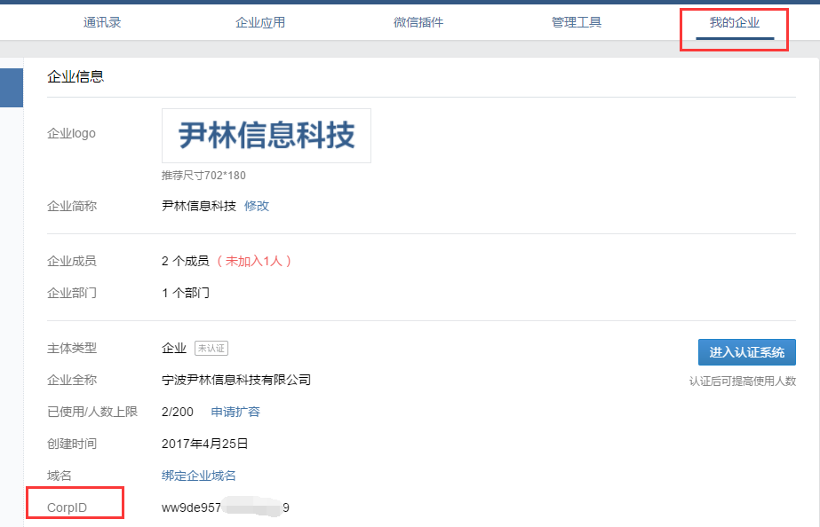
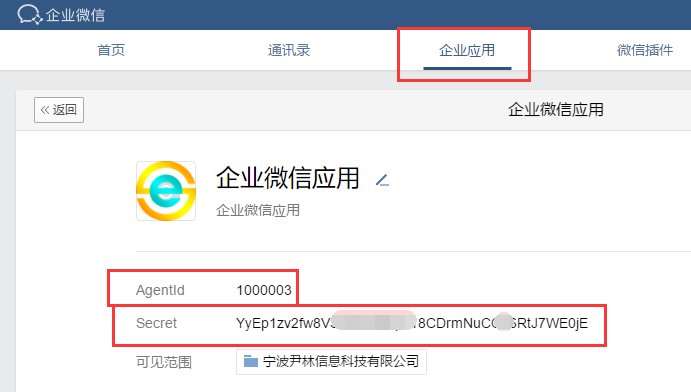
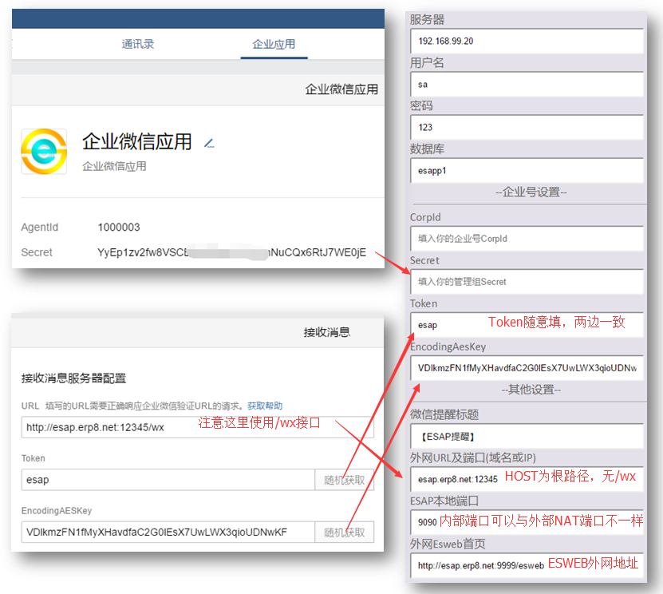

# 快速开始

* [申请企业微信](#申请企业微信)
* [设置企业应用](#设置企业应用)
* [安装服务](#安装服务)
* [启动配置](#启动配置)
* [更改高级配置](#更改高级配置)

## 申请企业微信
* 首先到企业微信官网申请账号：[https://work.weixin.qq.com/](https://work.weixin.qq.com/)

## 设置企业应用
* 登陆企业微信,进入【我的企业】，记录下`CorpID`



* 进入【企业应用】--【添加应用】--【创建应用】,进入该应用记录下`AgentId`和`Secret`



* 点击【接收消息】--【设置】，可进入回调界面，暂停企业微信的设置，准备安装ESAP。

## 安装服务
* 从ESAP官方首页：[https://erp8.net/esap/](./README.md)下载最新的服务器文件包。

* 解压下载的文件包，将其中`【微信提醒】`模板导入你的ES应用中。

> 注意，模板导入时可能会提示导入公式或工作流出错，这个是正常的，请无视。

## 启动配置
* 双击esap.exe启动即可,首次启动后会自动进入配置界面，默认是:[localhost:9090/conf](https://localhost:9090/conf)

各参数配置示例如下：



## 更改高级配置

* 完成首次配置保存后，会生成esap.yml配置文件，用Notepad++手工编辑可开启一些高级配置。

```yaml
 corpid: #你的企业号CorpID 
 secret: #你的管理组Secret
 txlsecret: #你的通讯录同步Secret
 token: #你的企业号应用回调统一token，随意填写
 encodingAesKey:  #你的企业号应用回调统一EncodingAesKey
 agents:
  1000002: "1000002的secret"  #多应用代理，可自行往下复制扩展
  1000003: "1000003的secret"
 port: 9090  #ESAP服务端口
 wxtxTitle: 【ESAP提醒】  #微信提醒标题
 wxqdtitle: "" #微信签到标题
 needWxOAuth2: false
 host: www.erp8.net:12345 #ESAP外网IP(域名),不填端口号则使用port端口
 esweb: http://www.erp8.net:9999/esweb #ESweb外网页面
 server: . #数据库服务器，本机可填.号，完整示例：192.168.1.10/实例名,端口
 userId: sa #数据库用户名
 pwd: 123 #数据库密码
 dbName: esap #ES应用数据库，改成自己的库，例如esapp1
 retrymsg: false  #微信提醒失败重发开关，为true时开启
 showfunclist: false #微信查询未匹配时显示可用列表开关，为true时开启
 showfunclistenter: false #用户进入时显示可用列表开关，为true时开启
 debug: true #调试模式开关，为true时开启，log中输出调试详情
```

> 注意，不推荐用windows的记事本编辑，可能会导致无法读取配置

**2.8+版本可以通过admin模块可视化管理这些高级配置**
