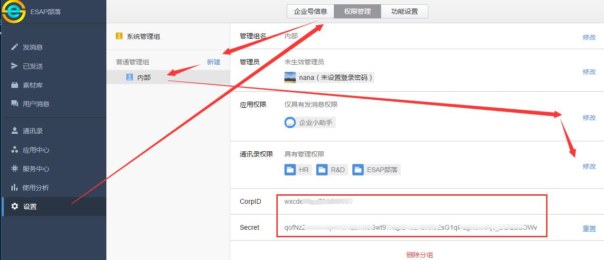
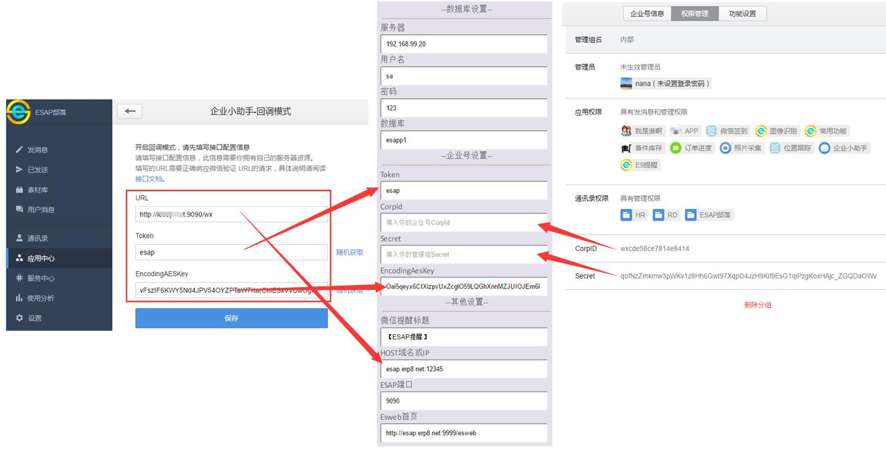

# 快速开始

* [申请微信企业号](#申请微信企业号)
* [设置管理权限](#设置管理权限)
* [下载导入模板](#下载导入模板)
* [启动配置API](#启动配置API)
* [更改高级配置](#更改高级配置)

## 申请微信企业号
* 首先到微信公众平台申请企业号：[https://mp.weixin.qq.com/](https://mp.weixin.qq.com/)

## 设置管理权限
* 登陆你申请好的企业号，进入【设置】--【权限管理】--【新建普通管理组】

* 接下来对该管理组设置：【设置管理员】

* 接下来对该管理组设置：【设置应用权限】-【勾选企业小助手】

* 同时设置【通讯录权限】-【勾选所有成员的管理权】

* 记录下 **【CorpID】** 和 **【Secret】** ，这两个参数在后面会用到。



## 导入模板
* 从项目首页：[https://erp8.net/esap/](./README.md)下载最新的服务器文件包。

* 解压下载的文件包，将其中`【微信提醒】`模板导入你的ES应用中。

> 注意，模板导入时可能会提示导入公式或工作流出错，这个是正常的，请无视。

## 启动配置API
* 双击esap.exe启动即可,首次启动后会自动进入配置界面，默认是:[localhost:9090/conf](https://localhost:9090/conf)



## 更改高级配置

* 完成首次配置保存后，会生成EsConf配置文件，用Notepad++手工编辑可开启一些高级配置。

```json
{
 "Token": "你的企业号应用回调token，例如：esap",
 "EncodingAesKey": "你的企业号应用回调EncodingAesKey",
 "CorpId": "你的企业号CorpId", 
 "Secret": "你的管理组Secret",
 // ESAP服务端口
 "Port": "9090",
 // 微信提醒标题
 "WxtxTitle": "【ESAP提醒】",
 // 提醒扫描间隔(分钟)，填0则不扫描
 "WxtxDuration": 1,
 // 邮件扫描间隔(分钟)，填0则不扫描
 "MailDuration": 2,
 "NeedWxOAuth2": false,
 // ESAP外网IP(域名)
 "Host": "www.erp8.net",
 // ESweb外网页面
 "Esweb": "http://www.erp8.net:9999/esweb",
 // 数据库服务器，本机可以只填个.，支持自定义实例端口，示例：192.168.1.10/实例名,端口
 "Server": "192.168.99.20",
 // 数据库用户名
 "UserId": "sa",
 // 数据库密码
 "Pwd": "123",
 // ES应用数据库，可以改成esapp1
 "DbName": "esap",
 // 微信提醒重发开关，为true时，发送失败的提醒将重发，默认为false
 "ReTryMsg": false, 
 // 微信查询列表开关，为true时，查询未匹配时显示可用列表，默认为false
 "ShowFuncList": false, 
 // 微信查询列表开关，为true时，并且回调勾选了用户进入上报，则用户进入时显示可用列表，默认为false
 "ShowFuncListEnter": false,
 // 调试模式开关，为true时，log中输出调试详细信息
 "Debug": true
}
```

> 注意，不要用windows的记事本编辑，可能会导致无法读取配置
