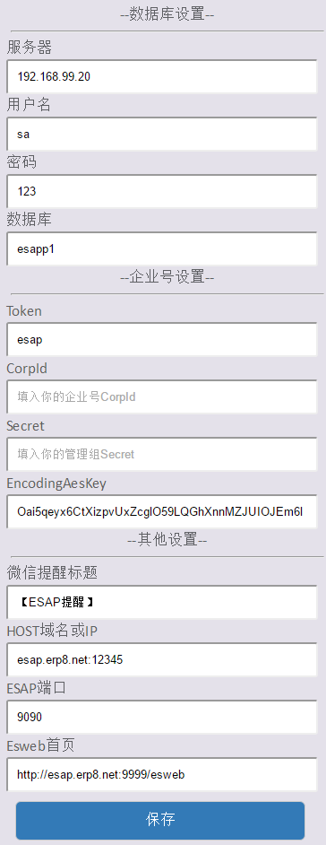
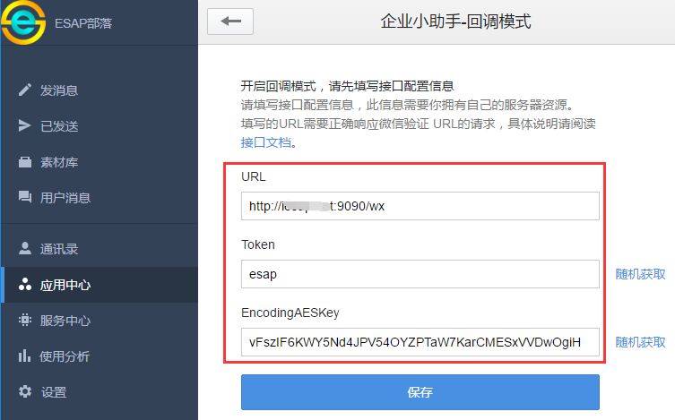
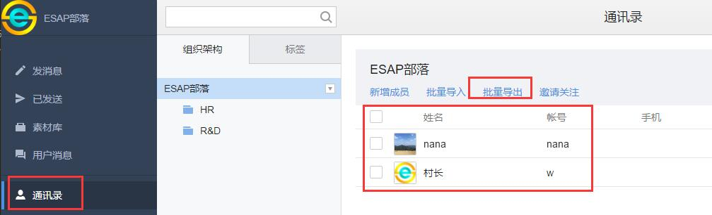
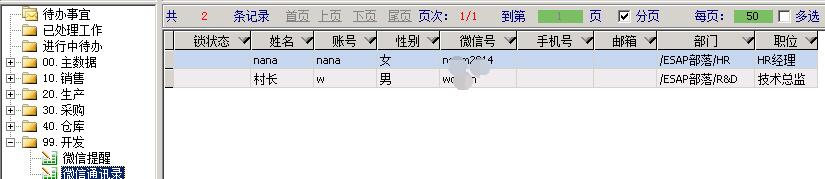
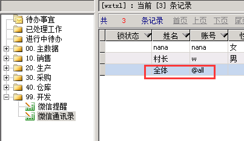
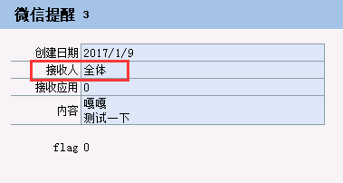
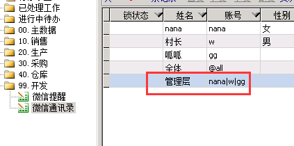
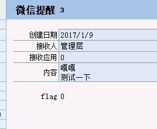
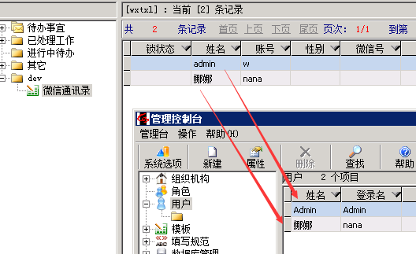

# 快速开始

- [发消息给全体](#发消息给全体)

- [发消息给用户组](#发消息给用户组)

- [发图片或文件消息](#发图片或文件消息)

- [发密图文消息](#发密图文消息)

- [发普通图文消息](#发普通图文消息)

- [发待办提醒](#发待办提醒)

- [微信办理工作流](#微信办理工作流)

- [微信签到](#微信签到)

- [使用微信图库](#使用微信图库)

- [开启Debug模式](#开启Debug模式)

## 申请微信企业号
* 首先到微信公众平台申请企业号：[https://mp.weixin.qq.com/](https://mp.weixin.qq.com/)

## 设置管理权限
* 登陆你申请好的企业号，进入【设置】--【权限管理】--【新建普通管理组】

* 接下来对该管理组设置：【设置管理员】

* 接下来对该管理组设置：【设置应用权限】-【勾选企业小助手】

* 同时设置【通讯录权限】-【勾选所有成员的管理权】

* 记录下 **【CorpID】** 和 **【Secret】** ，这两个参数在后面会用到。


## 下载微信模板和ESAP服务器程序
* 从项目首页：[https://erp8.net/esap/](./README.md)下载最新的模板以及程序，可选择x86或x64版本。

## 导入模板
* 解压下载的<a href="./db/wechat_tmp.rar" target="_blank">wechat_tmp.rar</a>，将其中`【微信提醒】`模板导入你的ES应用中。

## 启动API
* 双击esap.exe启动即可,首次启动后会自动进入配置界面，默认是:[localhost:9090/conf](https://localhost:9090/conf)



## 关于EncodingAesKey
可以从企业号进入`【企业小助手】`，设置回调模式的界面获取。



## 创建微信提醒消息
* 在创建消息前请先确保企业号的通信录已经导入到ES的【微信通讯录】中。

> 2.6+不再需要`微信通讯录`





* 在ES中新建一条【微信提醒】记录，也可以回写新建，例如像这样：


* 最迟一分钟后，你将收到来自微信企业号的提醒内容。


> 2.5+可以通过设置`cDate`来推迟消息的发送。

## 发消息给全体
* 在【ES微信通讯录】加个特别用户，账号为@all，姓名随意，例如`全体`。


 
* 新建提醒，姓名填`全体`。



> 2.6+直接在接收人字段填报`@all`即可

## 发消息给用户组
在ES微信通讯录加些特别用户，账号为 **多个员工账号，用`|`隔开** ，例如`nana|w|gg`，姓名随意，例如`管理层`。




> 2.6+支持逗号隔开的多个通讯录信息，例如姓名，账号，部门，职位等。


## 发图片或文件消息
当`pic`字段或`fh`字段 **有值** 时，系统自动发送。


> 2.5+，需要在网盘所在服务器上运行，或将网盘根目录映射到本地(盘符一致)。

## 发密图文消息
当wxtxd表中有值时自动发送，`pic`，`title`，`content`字段必填。


> 2.5+，微信限制每天100条。

## 发普通图文消息
当wxtxd表`pic`字段无值，`title`，`digest`,`content`,`url`字段有值时自动降级为普通图文消息。


> 2.5+

## 发待办提醒
* 在ES系统的ES_Witodo表上加上下列触发器即可

* 注意，**`ES系统用户名要跟ES微信通讯录的姓名一致`**



```sql
USE [esapp1] --改成你自己的数据库
GO
-- =============================================
-- Author:        woylin
-- Create date:   2017-2-15
-- Description:   esap2.5
-- =============================================
CREATE TRIGGER [tWxtx] 
   ON [ES_Witodo] 
   AFTER INSERT
AS 
BEGIN    
    SET NOCOUNT ON;    
    insert wxtx(cdate, toUser, toAgent, content, usr, wi) 
    select getdate(), UserName, 0, f.pName + wiDesc, u.UserLogin, wi.wiId
    from ES_WorkItem wi, ES_User u, inserted i, ES_WfTask t,ES_WorkFlow f
    where wi.wiId=i.wiId and i.userId=u.UserId and wi.tId=t.tId and t.pId=f.pId
    and isnull(wi.wiDesc,'')<>''
END
GO
```

效果图：


## 微信签到
开启`企业小助手`回调并勾选`上报地理位置`。


* 导入`微信签到`模板；
* 用户进入小助手时，允许上报地理位置；
* 直接回复`签到`即可，签到信息同步到ES签到模板。

效果图：


* 也可以设置一个key为`wxqd`的自定义按钮。


> 2.5+

## 使用微信图库
* 导入`微信图库`模板；
* 进入`企业小助手`选择相册或拍摄，再填入照片描述即可。
* 支持连续发送多个图片，再填入该组照片描述。


> 2.5+

## 开启Debug模式

* 配置文件EsConf看起来是这样：

```json
{
 "Token": "你的企业号应用回调token，例如：esap",
 "EncodingAesKey": "你的企业号应用回调EncodingAesKey",
 "CorpId": "你的企业号CorpId", 
 "Secret": "你的管理组Secret",
 // ESAP服务端口
 "Port": "9090",
 // 微信提醒标题
 "WxtxTitle": "【ESAP提醒】",
 // 提醒扫描间隔(分钟)，填0则不扫描
 "WxtxDuration": 1,
 // 邮件扫描间隔(分钟)，填0则不扫描
 "MailDuration": 2,
 "NeedWxOAuth2": false,
 // ESAP外网IP(域名)
 "Host": "www.erp8.net",
 // ESweb外网页面
 "Esweb": "http://www.erp8.net:9999/esweb",
 // 数据库服务器，本机可以只填个.，支持自定义实例端口，示例：192.168.1.10/实例名,端口
 "Server": "192.168.99.20",
 // 数据库用户名
 "UserId": "sa",
 // 数据库密码
 "Pwd": "123",
 // ES应用数据库，可以改成esapp1
 "DbName": "esap",
 // 修改为true重启ESAP即可打印调试信息
 "Debug": true
}
```

> 注意，最好用Notepad++或者sublime等文本编辑器，不要用windows的记事本编辑，可能会导致无法读取配置
