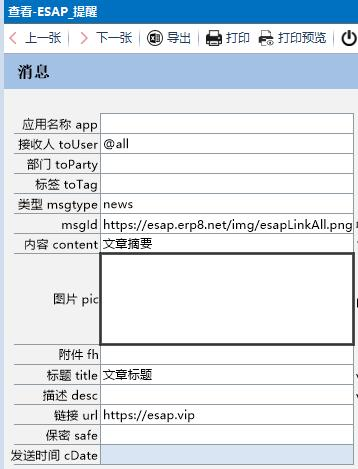

# 微信提醒

* [创建微信提醒消息](#创建微信提醒消息)
* [发消息给全体](#发消息给全体)
* [发消息给用户组](#发消息给用户组)
* [发图片或文件消息](#发图片或文件消息)
* [发密图文消息](#发密图文消息)
* [发普通图文消息](#发普通图文消息)
* [发保密消息](#发保密消息)
* [发待办提醒](#发待办提醒)
* [发查看提醒](#发查看提醒)
* [其他事项](#其他事项)

## 创建微信提醒消息

* 在ES中新建一条【微信提醒】记录，也可以回写新建，例如像这样：


* 最迟一分钟后，你将收到来自微信企业号的提醒内容。


> 通过设置`cDate`可推迟消息的发送，`content`可以包含换行`br`和超链接`a`标签。

## 发消息给全体
接收人字段填`@all`即可

## 发消息给用户组
接收人填逗号隔开的多个通讯录信息，例如“姓名”，“手机号”，“账号”，“部门”，“职位”或者“部门/职位”


## 发图片或文件消息
当`pic`字段或`fh`字段 **有值** 时，系统自动发送。


> 需要在网盘所在服务器上运行，或将网盘根目录映射到本地(盘符一致)。

## 发密图文消息
当wxtxd表中有值时自动发送，`pic`，`title`，`content`字段必填。


> 注意：微信限制了密图文消息，每天仅100条。

## 发普通图文消息
当wxtxd表`pic`字段无值，`title`，`digest`,`content`,`url`字段有值时自动降级为普通图文消息。




> 此时内容为图片链接，如果内容(content)无值，则消息降级为带链接跳转的普通文字消息。

## 发保密消息
当wxtx表的safe=1时自动发送。


> 2.6+，保密消息只是相对的，请勿过于依赖。

## 发待办提醒
* 在ES系统的ES_Witodo表上加上下列触发器即可

* 注意，**`ES系统用户名和账号要跟企业号通讯录的姓名账号一致`**

```sql
USE [esap] --改成你自己的数据库
GO
-- =============================================
-- Author:        woylin
-- Create date:   2017-5-18
-- Description:   esap2.8
-- =============================================
IF  EXISTS (SELECT * FROM sys.objects 
WHERE object_id = OBJECT_ID(N'tWxtx') AND type in (N'TR'))
DROP TRIGGER [tWxtx]
GO
CREATE TRIGGER [tWxtx] 
   ON [ES_Witodo] 
   AFTER INSERT
AS 
BEGIN    
    SET NOCOUNT ON;    
    insert esap..wxtx(cdate, toUser, toAgent, content, usr, wi, db) --esap改成你自己的数据库，db字段用于多帐套
    select getdate(), UserName, 0, f.pName + wiDesc, u.UserLogin, wi.wiId, 'esap' --esap可改成其他账套数据库，0改成你的agentID,例如1000002
    from ES_WorkItem wi, ES_User u, inserted i, ES_WfTask t,ES_WorkFlow f
    where wi.wiId=i.wiId and i.userId=u.UserId and wi.tId=t.tId and t.pId=f.pId
    and isnull(wi.wiDesc,'')<>'' and ISNULL(wi.state1,0)<>1
END
GO
```

效果图：


企业微信效果图：


> 2.5+，其他配置同[微信办理](/s3.md#微信办理)

## 发查看提醒
* 当rcid有值时自动发送，此时content为提醒文章的内容描述，usr为查看表单使用的ES用户账号。


> 2.6+，其他配置同[微信办理](/s3.md#微信办理)

## 其他事项
sql模板位置：sql/get/wxtx.tpl, 默认使用`top 1000`防止误操作超限，可自行更改。

>2.8+