# 微信超级查询
* ESAP对企业小助手回调接口进行了增强，可以自定义SQL语句，自定义权限，实现引擎式超级查询。

* 使用前提：
 * 1.开启企业小助手的回调模式(回调URL示例：http://阿里云IP:9090/wx)；
 * 2.导入`微信查询` 模板。
 * 3.微信查询使用的必要前提是会sql，请自行学习！

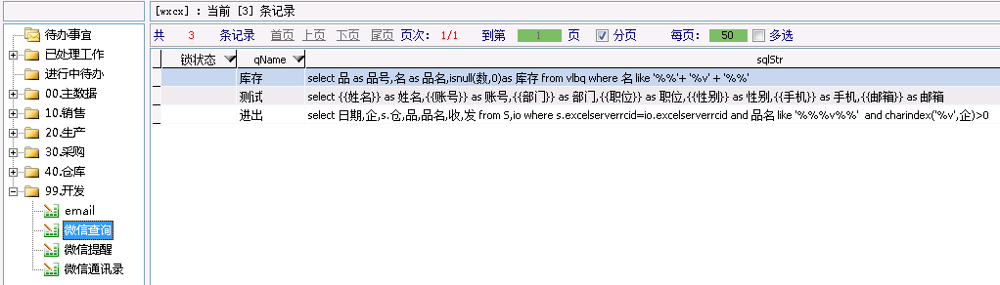

- [支持多重权限](#支持多重权限)
- [支持企业号通讯录变量](#支持企业号通讯录变量)
- [支持语音查询](#支持语音查询)
- [支持扫码查询](#支持扫码查询)
- [支持图片附件查询](#支持图片附件查询)
- [支持回写数据](#支持回写数据)
- [支持微信填报](#支持微信填报)
- [支持菜单填报](#支持菜单填报)
- [支持表单查询](#支持表单查询)
- [支持待办列表打开](#支持待办列表打开)

#### 支持多重权限
用逗号隔开，可用姓名，账号，部门随意组合。

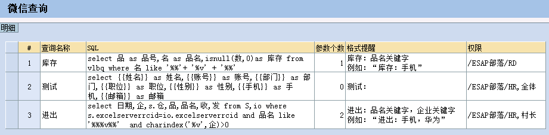

#### 支持企业号通讯录变量
* \{\{姓名\}\} 对应 `姓名`
* \{\{账号\}\} 对应 `账号`
* \{\{部门\}\} 对应 `部门`
* \{\{职位\}\} 对应 `职位`
* \{\{性别\}\} 对应 `性别`
* \{\{手机\}\} 对应 `手机号`
* \{\{邮箱\}\} 对应 `邮箱`

效果图：

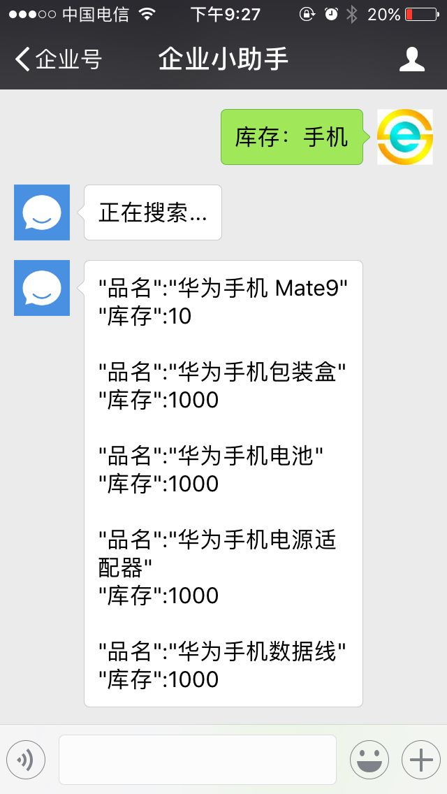
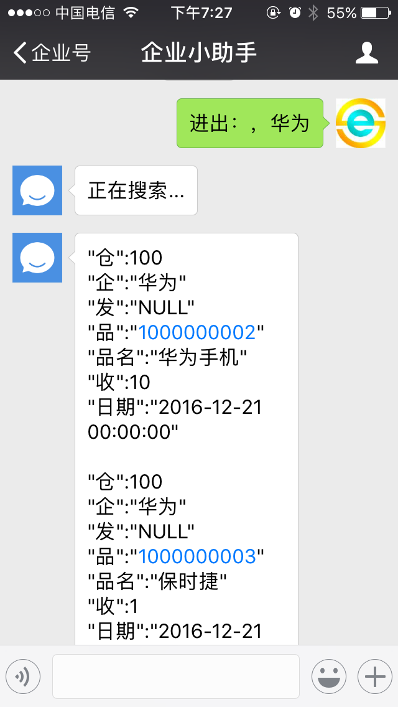
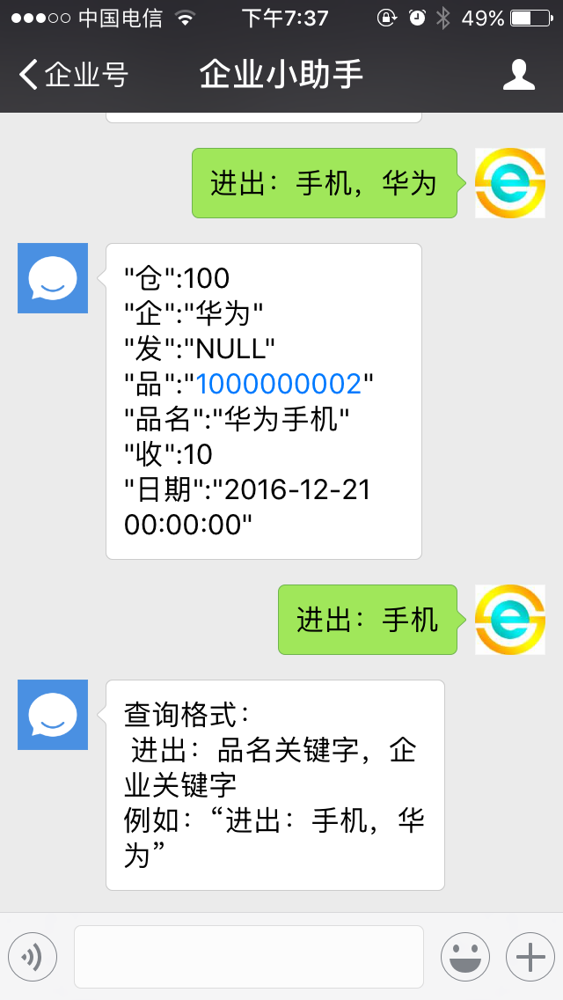

#### 支持语音查询


#### 支持扫码查询
二维码或其他条码等

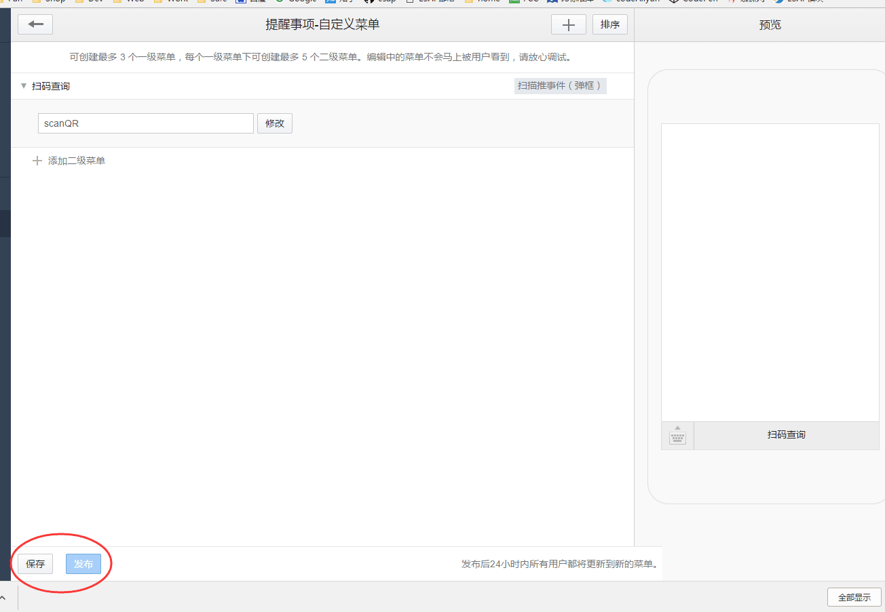
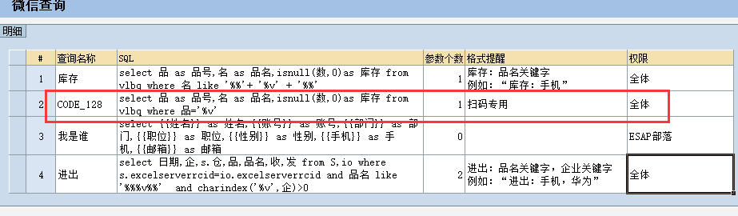


#### 支持图片附件查询
sql结果字段或别名为`pic`或`图片`，`files`或`附件`

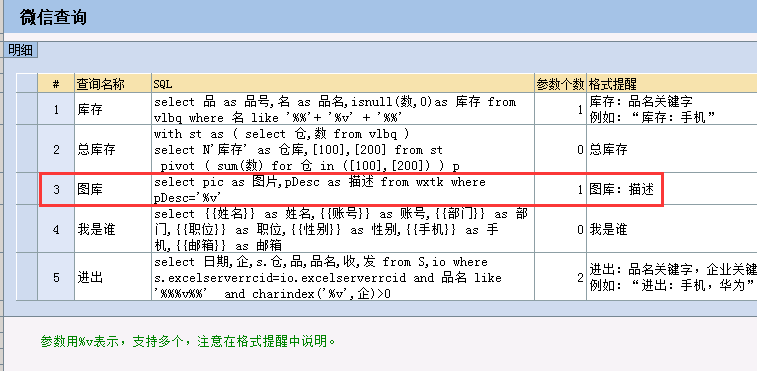

* 支持多个`图片`或`附件`


> 注意微信限制：图片一般不能超过2M,附件不超过20M

#### 支持回写数据
sql中使用update或insert

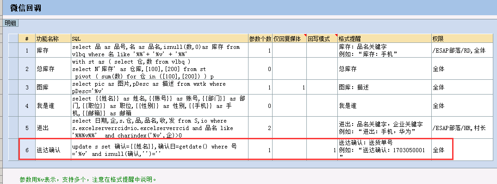


> 2.5+

#### 支持微信填报
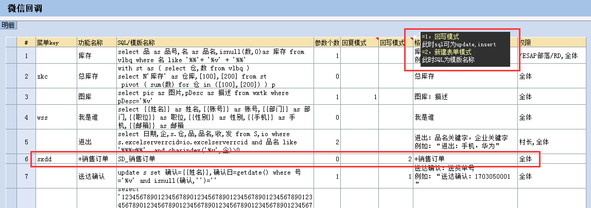


> 2.5+，其他配置同[微信办理](./s3.md#微信办理)

#### 支持菜单填报
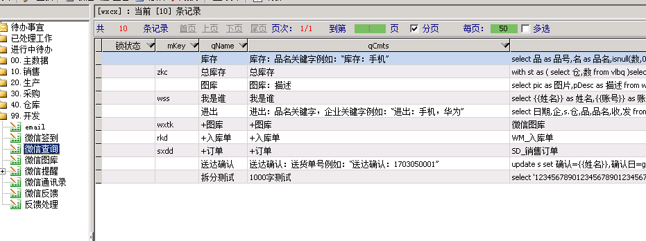


> 2.5+，其他配置同[微信办理](./s3.md#微信办理)

#### 支持表单查询
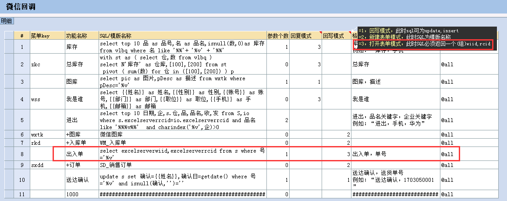


> 2.6+，其他配置同[微信办理](./s3.md#微信办理)

#### 支持待办列表打开
设置一个自定义菜单，key为`dbsy`即可


* 建议修改Esweb\main\todoViews.aspx，head下增加一个<meta>标签，以便适应移动访问，内容如下：

```
<meta name="viewport" content="width=device-width,initial-scale=1">
```

> 2.6+，其他配置同[微信办理](./s3.md#微信办理)
