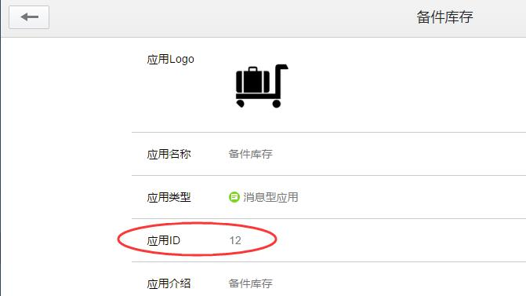
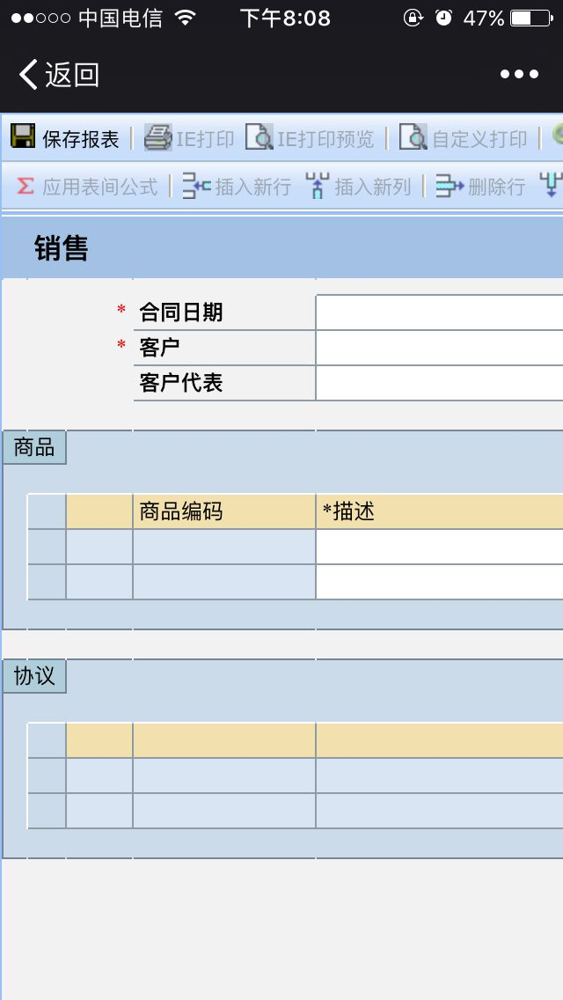
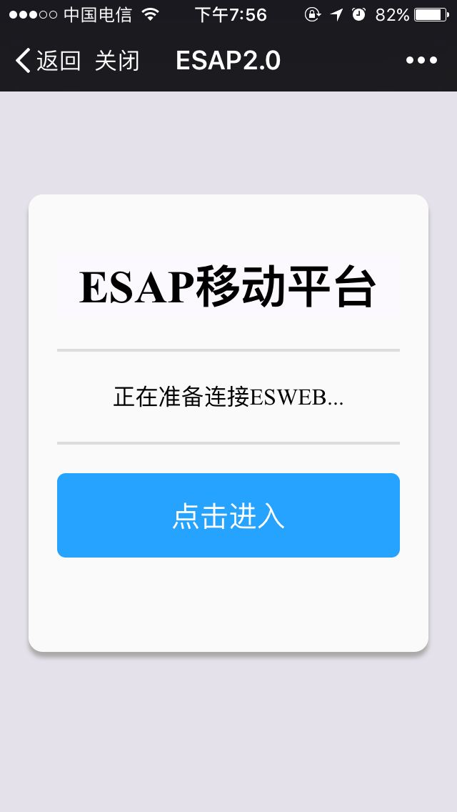
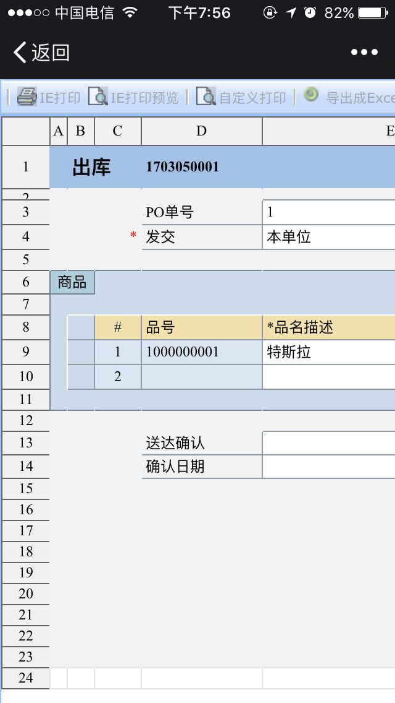
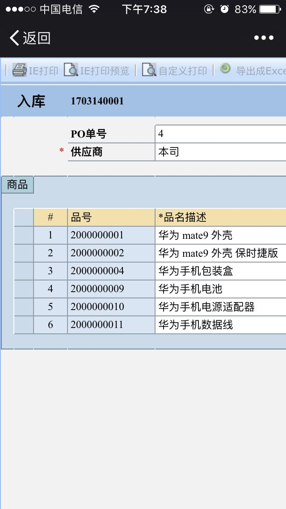
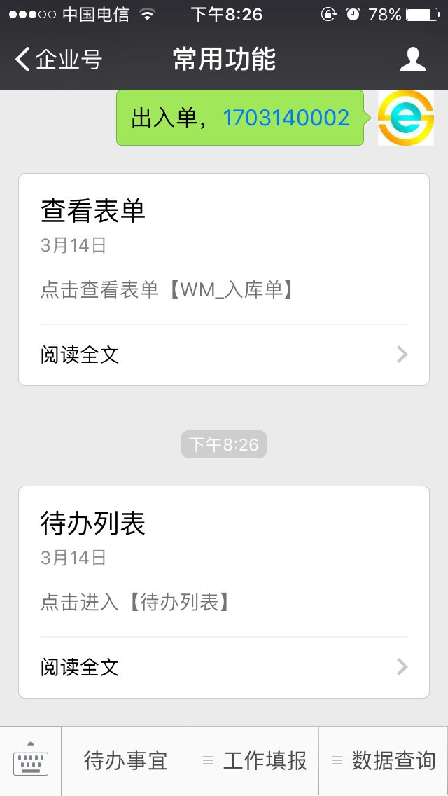

# 微信超级查询
* ESAP对微信应用回调接口进行了增强，可以自定义SQL语句，自定义权限，实现引擎式超级查询。
* 依赖`微信查询` 模板。
* 需开启企业小助手的回调模式(回调URL示例：http://阿里云IP:9090/wx)；


**微信查询使用的必要前提是会sql，请自行学习！**

- [新版特性](#新版特性)
- [参数解释](#参数解释)
- [支持多重权限](#支持多重权限)
- [支持企业号通讯录变量](#支持企业号通讯录变量)
- [支持语音查询](#支持语音查询)
- [支持扫码查询](#支持扫码查询)
- [支持图片附件查询](#支持图片附件查询)
- [支持回写数据](#支持回写数据)
- [支持默认应用](#支持默认应用) <span style="color:red">new!</span>
- [支持微信填报](#支持微信填报)
- [支持菜单填报](#支持菜单填报)
- [支持表单查询](#支持表单查询)
- [支持待办列表打开](#支持待办列表打开)

#### 新版特性
* 2.6+支持模板语法，动态参数和动态sql

[点击这里参考更多用法](https://app.esap.vip/admin#/wxcx)


####  参数解释
* 用户的输入(逗号或句号分隔)会被esap解析为p0,p1,p2...pn,以及一个特别的P代表输入的所有内容

例如用户输入：`库存，手机，一号仓` 会被解析为可用参数：`p0=库存，p1=手机，p2=一号仓,P=库存，手机，一号仓`

* 在sql中使用{ {.pn} }作参数替换，如果跟在等于号（=）后面作为值替换，可以直接使用:pn。

例如： `select 姓名,工号 from { {.p0} } where 姓名=:p1`

* 要注意的是{ {.pn} }用在文本型值位置应该加上单引号，以免被sql误认为是字段，而:pn形式则不需要。

所以上面的语句等价于： `select 姓名,工号 from { {.p0} } where 姓名='{ {.p1} }'`

#### 支持多重权限
用逗号隔开，可用姓名，账号，部门随意组合。

#### 支持企业号通讯录变量
* \{\{姓名\}\} 对应 `姓名`
* \{\{账号\}\} 对应 `账号`
* \{\{部门\}\} 对应 `部门`
* \{\{职位\}\} 对应 `职位`
* \{\{性别\}\} 对应 `性别`
* \{\{手机\}\} 对应 `手机号`
* \{\{邮箱\}\} 对应 `邮箱`

#### 支持语音查询


#### 支持扫码查询
二维码或其他条码等,wxcx表中的mkey与自定义菜单的扫码弹框菜单key对应即可


#### 支持图片附件查询
sql结果字段或别名为`pic`或`图片`，`files`或`附件`

* 支持sql返回多个`图片`或`附件`


> 注意微信限制：图片一般不能超过2M,附件不超过20M

#### 支持回写数据
回写模式=1，sql中使用update或insert


> 2.5+

#### 支持默认应用
* 查询名称(qName)为应用ID，查询更纯粹，可以快速输入并查询。




* 或直接扫二维码秒查。


> 2.7+，注意新增的应用，管理组要配置相应权限。

#### 支持微信填报
回写模式=2，sql字段填模板名称




> 2.5+，其他配置同[微信办理](./s3.md#微信办理)

#### 支持菜单填报
设置mkey，与企业号应用自定义菜单中的key一致。


> 2.5+，其他配置同[微信办理](./s3.md#微信办理)

#### 支持表单查询
回写模式=3，sql返回的第二个值为rcid






> 2.6+，其他配置同[微信办理](./s3.md#微信办理)

#### 支持待办列表打开
设置一个自定义菜单，key为`dbsy`




* 建议修改Esweb\main\todoViews.aspx，head下增加一个<meta>标签，以便适应移动访问，内容如下：

```
<meta name="viewport" content="width=device-width,initial-scale=1">
```

> 2.6+，其他配置同[微信办理](./s3.md#微信办理)
