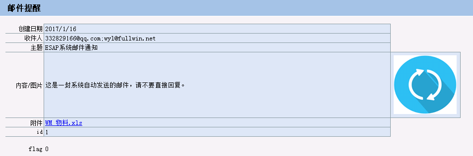
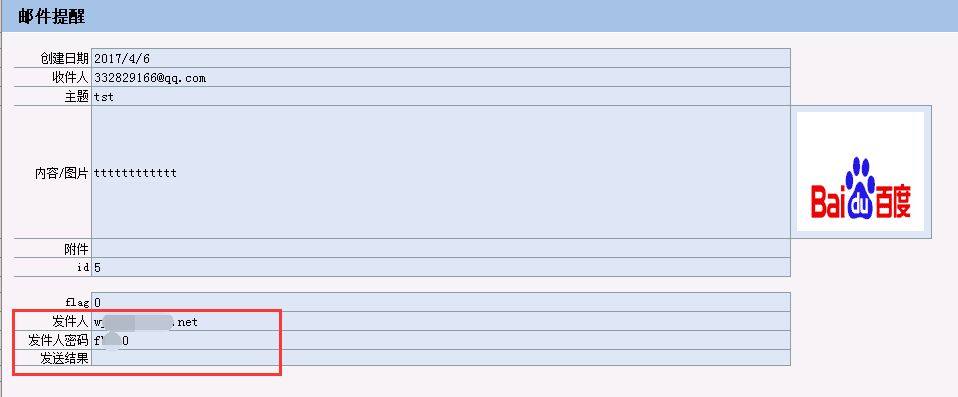
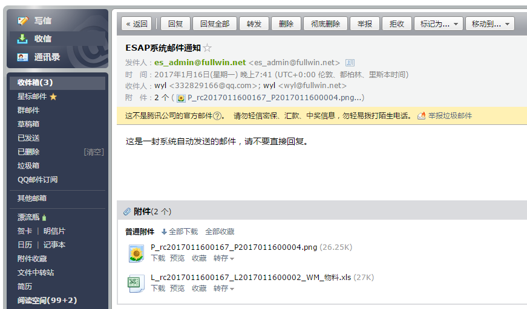
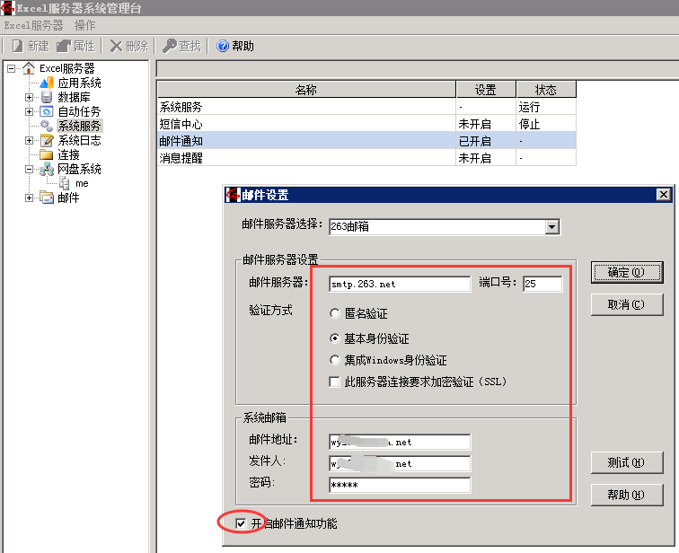

# 增强功能
ESAP增强了ES系统功能，以便ES更好的服务于企业。

* [邮件接口](#邮件接口)
* [微信办理](#微信办理)
* [移植ESAP](#移植ESAP)

## 邮件接口

ESAP实现了自己的邮件接口，可以加入图片或附件,发给多人时使用分号(;)或逗号(,)分隔。



2.7+可使用自定义的发件人，但发件人应与系统邮件发件人是同一个域，即smtp服务器设置相同。



效果图：



* 使用前提：
 * 依赖`email` 模板。
 * 1.开启网盘并设置了系统网盘；
 * 2.开启了邮件通知并设置邮件服务器。


## 微信办理
ESAP对微信提醒进行了工作流增强，可直接通过微信提醒办理ES待办事宜。

* 导入`微信提醒`模板；
* 确保你的Esweb能够正常访问，工作流模板勾选了网页填报。
* 配置了`Host`参数为外网可用域名或IP，`EsWeb`参数为可访问的esweb的url(最后面不要有斜杠)；
* 配置Esweb根目录的web.config文件的`RequestMainURL`键值为`http://HostIP或域名:ESAP端口/wi`(最后面不要有斜杠)

例如：
```
<add key="RequestMainURL" value="http://io.erp8.net:9090/wi" />
```

* 建议修改Esweb\main\Framemain.aspx，head下增加一个<meta>标签，以便适应移动访问，内容如下：

```
<meta name="viewport" content="width=device-width,initial-scale=1">
```

效果图：


> 2.4+

## 移植ESAP
ESAP服务器直接与MSSQL交互，使用MSSQL的程序或系统都可以移植，包括并不限于下列项目：

+ 勤哲Excel服务器
+ 冠日网络Excel平台
+ 金蝶
+ 用友
+ 速达
+ SAP
+ FineReport
+ 快表
+ 云表

#### 移植到Excel服务器

* 如果你使用的是9.4+版，恭喜你，只需要将压缩包中的`微信提醒`模板导入到你的生产应用中，然后启动esap服务器即可。

* 如果是es9.4以下版本，例如7.1.7，8.4，9.2等，则需要自行建立这些`模板`，并保证表名和字段名一致即可。

#### 移植其他平台或ERP系统

* 只要是使用MSSQL，都可以自行建立这些`模板`的数据表，并保证名称类型一致即可。
