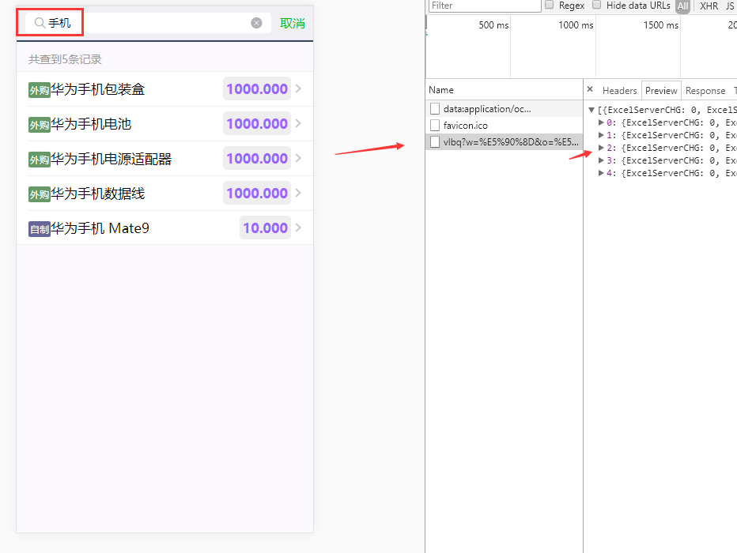
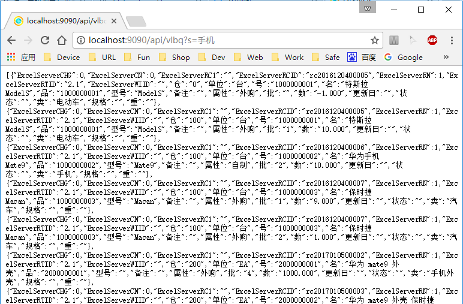

# SQL模板
* 从2.7版开始，ESAP引入了sqlt库[github.com/it512/sqlt](https://github.com/it512/sqlt)作为sql操作的中间件。

* 同时，村长在ESAP内部实现了许多自定义函数，使用ESAP的模板功能，你可以快速打造基于SQL的数据API。

## 什么是API
* API是前后端分离后的一种后端服务，专注于提供数据访问，ESAP的API服务采用流行的json格式。

* ESAP启动时，会自动建立`/api/*`,`/api2/*`,`/es/*`,`/es2/*`等几组API路由，APP和桌面版就是使用这些路由调用sql模板,实现数据查询和创建ES表单等功能。

## 查询服务
* 我们以APP的库存查询为例子演示sql模板的查询输出功能。

* 在APP的库存查询搜索框输入`手机`时，前端(APP)就会向后端(ESAP)发起一个GET请求，请求地址是`/api/vlbq?s=手机`,然后ESAP返回数据，APP展示数据。



* ESAP是如何获取数据的呢？实际上是搜索了`sql/esap/*.get`中的`vlbq`模板，然后解析执行sql,返回结果集的json编码。

```sql
{ {define "vlbq"} }
	select * from vlbq where 名 like '%{ {.s} }%'
{ {end} }
```

* 这个模板十分简单，有助于我们熟悉了解模板语法，首先用define定义了vlbq这个sql模板，尾部用{ {end} }结束,模板中的请求参数用双花括号包裹。

* 模板中的{ {.s} }执行时会替换成实际的请求参数s，也就是`手机`,所以最终执行的sql语句是：`select * from vlbq where 名 like '%手机%'`

* 我们可以在浏览器直接输入`http://localhost:9090/api/vlbq?s=手机`,来感受一下这个API数据的回传。



## 模板语法
* sql模板使用了go语言的标准库text/template进行解析,所有的语法都与标准库兼容，包括标准模板函数。

* 此外，sql模板还支持使用命名变量，也就是使用:s(`冒号+参数`)的形式，微信查询中的:pn就是这个原理，需要注意的有两点：

 - 如果字段的值内容中有冒号，那么需要用双冒号来实现转义，例如： `select N'小新说::大象你的鼻子怎么这么长？'` 才能输出：`小新说:大象你的鼻子怎么这么长？`
 - 如果参数名是中文，那么不支持命名变量，所以你不能写成这样：`select :品名`，而必须写成：`select '{ {.品名} }'`

* 其他模板语法和函数可以百度[golang 模板语法](https://www.baidu.com/s?wd=go语言 模板语法)

## 变量与函数
* 在sql模板里可定义变量和调用一些强大的自定函数，语法是：
```
{ {funcname .arg1 .arg2} }
```

* 例如我们要产生一个新的图片picNo就可以直接这样写：
```
declare @picNo nvarchar(20)
set @picNo ='{ {newpicno} }' --会调用ES存储过程生成新图片号'P0000000x'，后续语句可以直接使用@picNo
select @picNo
```

* 上面语句使用了sql原生变量，当然我们也可以用模板变量：
```
{ {$picno := newpicno} }' --后续语句可以直接使用{ {$picno} }
select '{ {$picno} }'
```

## *实用自定义函数[高级教程]
|函数名称|类型|说明|
|:----:|:--:|:--:|
|and|标准|and 条件|
|not|标准|not 条件|
|or|标准|or 条件|
|range|标准|子项遍历|
|uuid|ESAP|唯一机器编码，类似GUID|
|newrcid|ESAP|调用GetNewId_s获取ES新rcid|
|newpicno|ESAP|调用GetNewId_s获取ES新picNo|
|newlinkno|ESAP|调用GetNewId_s获取ES新linkNo|
|rtid|ESAP|传入模板名称获取rtid|
|addpic|ESAP|插入指定url的图片到特定表单字段，下载图片到网盘，原型是 DownloadPic(picUrl, tableName, fieldName, rcid, picNo)|
|addlink|ESAP|插入指定url的文件到特定表单字段，下载文件到网盘，原型是 DownloadFile(picUrl, filename, tableName, fieldName, rcid, linkNo)|
|int64date|ESAP|将日期戳转换成日期，主要用于微信审批同步的日期处理|
|int64datetime|ESAP|将日期戳转换成日期时间，主要用于微信审批同步的日期+时间处理|
|getwechatname|ESAP|根据微信userid获取姓名|
|checktableid|ESAP|检查table中某id是否存在，原型是CheckTableId(table, field, value)|
|linkname|ESAP|使用linkno换取附件名|
