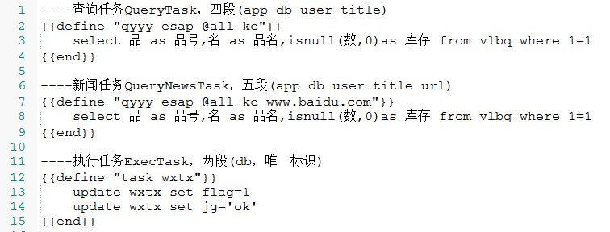

# 计划任务
* 2.7版开始，新增了计划任务功能，目前包括两种用户计划任务和几种系统计划任务(微信提醒，esmail，通讯录同步，审批同步，打卡同步)：

 1. 查询任务QueryTask（select）
 2. 执行任务ExecTask（update/insert/delete）

## 配置方式
* 首先，到sql/get/task.tpl中编辑需要执行的sql模板

* `查询任务ID`为三段式，分别代表:应用ID，接收人，唯一标识，用点号`.`分隔。

* 企业小助手ID是0，接收人可用逗号`,`分隔多个，唯一标识随意填写，不重复为原则。



* 其次，到根目录下修改task.json，可按需增加多条任务(tasks)项目,并与sql模板绑定。

```json
{
	"Global": {
		"IsRun": true,         // 全局开关
		"LogPath": "d:/"       // 日志路径
	},
	"Tasks": [
		{
			"Taskid": "21.w,wyl.kc",    // sql模板ID，每分钟会执行一次库存扫描并通过应用(ID=21)发微信消息送给用户`w,wyl`；
			"TaskType": "cron",			
			"Isrun": false,				// 局部开关
			"Express": "0 */1 * * * *", // 秒，分，时，日，月，周(运行计划周期)
			"Handlername": "QueryTask"	// 查询任务类型
		},
		{
			"Taskid": "task.wxtx",		// 每天凌晨4点钟执行一次微信提醒置1任务，即忽略所有未发送成功的提醒。
			"TaskType": "cron",
			"Isrun": false,
			"Express": "0 * 4 * * *",
			"Handlername": "ExecTask"	// 执行任务类型	
		}
	]
}
```

**更改了任务计划配置task.json后，重启esap生效**


## Express表达式详解
|字段|允许值|特殊字符值|
|:----|:--:|:--:|
|秒|0-59|, - * /|
|分|0-59|, - * /|
|时|0-23|, - * /|
|日|1-31|, - * /|
|月|1-12|, - * /|
|周|0-7|, - * /|

|特殊字符值|意义|
|:----:|:--|
|*   | 表示所有值|
|-   | 表示一个指定的范围|
|,   | 表示附加一个并列值|
|/   | 符号前表示开始时间，符号后表示每次递增的值|

|示例表达式|意义|
|:----|:--|
|`0 0 12 * * *` |   每天中午12点触发|
|`0 15 10 * * *` |   每天上午10:15触发|
|`0 * 14 * * *` |   在每天下午2点到下午2:59期间的每1分钟触发|
|`0 */5 14 * * *` |   在每天下午2点到下午2:55期间的每5分钟触发|
|`0 */5 14,18 * * *` |   在每天下午2点到2:55期间和下午6点到6:55期间的每5分钟触发|
|`0 0-5 14 * * *` |   在每天下午2点到下午2:05期间的每1分钟触发|
|`0 10,44 14 * 3 3` |   每年三月的星期三的下午2:10和2:44触发|
|`0 15 10 * * 1-5` |   周一至周五的上午10:15触发|
|`0 15 10 15 * *` |   每月15日上午10:15触发|
