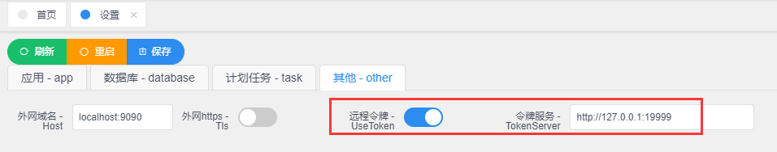

# 令牌服务

令牌服务<a href="./build/tokenserver.zip" download target="_blank">tokenserver</a>是4.0的核心组件，作用主要有两个：

* 为esap的应用提供`accesstoken`，这是发送消息能否成功的关键。

* 为esap查询提供token查询，例如百度AI。

## 配置方式

配置文件tc.yml内容类似下面，更改appid和appkey即可，url不需要更改，如不够可自行复制往下扩展，保持格式一致。

```yml
port: "19999"
apps:
  pub:
    appid: 服务号appid
    appkey: 服务号secret
    url: https://api.weixin.qq.com/cgi-bin/token?grant_type=client_credential&appid=%v&secret=%v
  esap:
    appid: 企业微信corpid
    appkey: 企业微信secret
    url: https://qyapi.weixin.qq.com/cgi-bin/gettoken?corpid=%v&corpsecret=%v
  txl1:
    appid: 企业微信corpid
    appkey: 企业微信通讯录secret
    url: https://qyapi.weixin.qq.com/cgi-bin/gettoken?corpid=%v&corpsecret=%v
  ding:
    appid: 钉钉appid
    appkey: 钉钉secret
    url: https://oapi.dingtalk.com/gettoken?appkey=%v&appsecret=%v
  bdai:
    appid: 百度appid
    appkey: 百度appkey
    url: https://openapi.baidu.com/oauth/2.0/token?grant_type=client_credentials&client_id=%v&client_secret=%v
  wxdk:
    appid: 企业微信corpid
    appkey: 企业微信打卡应用secret
    url: https://qyapi.weixin.qq.com/cgi-bin/gettoken?corpid=%v&corpsecret=%v
  wxsp:
    appid: 企业微信corpid
    appkey: 企业微信审批应用secret
    url: https://qyapi.weixin.qq.com/cgi-bin/gettoken?corpid=%v&corpsecret=%v
```

## 开启方式

`admin`-`设置`-`其他`



!> 注意，开启后，ESAP中所有开启的应用都要在tc.yml中进行配置，配置保存后重启`appEsapToken`服务，然后再重启esap，切记。

## 调用地址

请求方式：GET

返回JSON:

```
{"access_token":"xxxxxx","expire_time":1563118298}
```

URL示例：`http://127.0.0.1:19999/get/esap`
