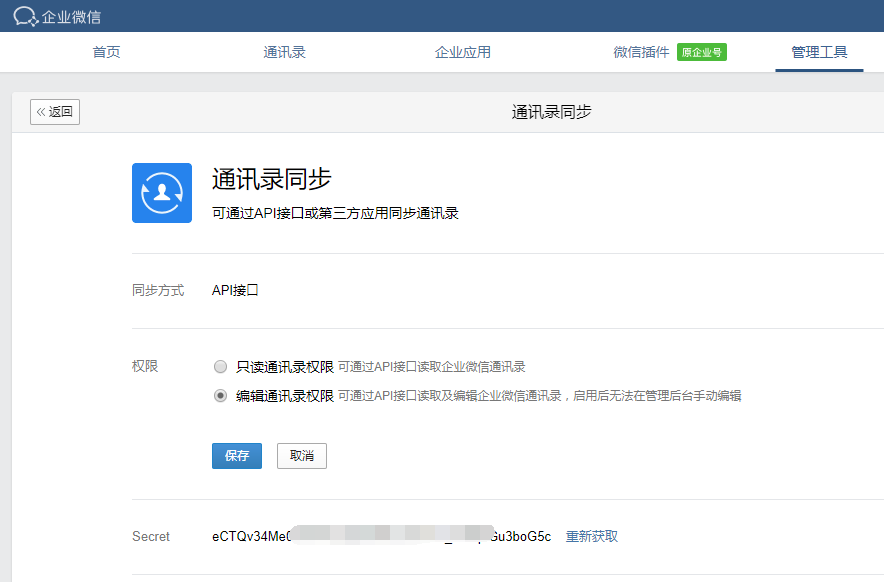
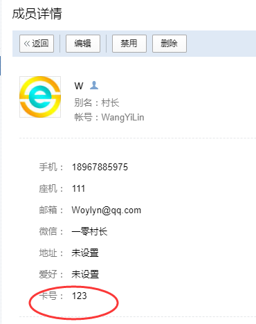

# 通讯录同步
* 通讯录同步计划，可直接同步本地部门、用户和角色到企业微信，默认不开启，需开启企业微信的编辑通讯录权限。

## 开启企业微信同步权限
* 登陆`企业微信`-`管理工具`-`通讯录同步`，权限选择`编辑通讯录权限`。



## 配置esap通讯录应用
* 应用AgentId为`9999999`（固定7个9），`secret`为上面的。


## 开启esap同步计划配置
* 建议周期20分钟


## *自定义通讯录同步<span style="color:red">(高级)</span>
esap允许自定义通讯录查询sql，对接各种系统的组织架构。

#### 具体步骤
* 在计划任务中配置脚本前缀，例如`my.`，然后复制`sql/esap/localuser.get`文件重命名成`my_txl.get`文件，使用`notepad++`进行编辑


* 定义带`my.`前缀的`my.sync.dept`，`my.sync.user`，`my.sync.tag`,`my.sync.taguser`四个模板，指向其他数据表，保证输出字段一致即可。

#### 更改示例
* 部门同步改到`我的部门表`，用户同步改到`我的用户表`

```sql
{{define "my.sync.dept"}}
	SELECT name, id, parentid, order as Order1 FROM 我的部门表
{{end}}

{{define "my.sync.user"}}
	SELECT userid, name, mobile, dept, position, Email, telephone, isleader, englishname, gender 
	FROM 我的用户表
{{end}}
```

## *通讯录自定义字段同步<span style="color:red">(高级)</span>
esap允许将自己的自定义字段同步到微信通讯录。

#### 具体步骤
* 先按[官网文档](https://work.weixin.qq.com/api/doc#90000/90135/90193/%E6%89%A9%E5%B1%95%E5%B1%9E%E6%80%A7%E7%9A%84%E6%B7%BB%E5%8A%A0%E6%96%B9%E6%B3%95)配置自己的自定义字段，例如村长加了`爱好`，`卡号`两个字段。

* 在前面的`my_txl.get`文件中定义`my.sync.userattr`脚本即可，示例如下：

```sql
{{define "my.sync.userattr"}}
	SELECT
		爱好,卡号  --这里的字段可以增减，最多250个，
	FROM esap_user where name=:name
{{end}}
```

