# 微信查询
* ESAP提供了快速对接微信公众号/企业号的回调接口，自定义SQL语句，自定义权限，实现引擎式超级查询。
* 需配置应用的`token`和`EncodingAesKey`，回调URL规则：
	`http://外网host/wx/应用名`

例如，假设外网域名是io.erp8.net，9090端口映射到内网ESAP服务器，那么回调URL如下:
	`http://io.erp8.net:9090/wx/esap`

!> 注意，公众号(服务号/订阅号)必须使用80端口，如无80端口可以用nginx或caddy做反向代理。

## 查询原理
* 系统根据用户输入的第一个关键字（例如下图的`库存`），扫描esap_cx表中对应的sql，执行并返回结果。
* 其他关键字被视为查询参数（例如下图中的`名`,`手机`），sql中可以使用`:p1,:p2`替换where条件。
```sql
select 品号,名 as 品名,库存 from 库存表 where {{.p1}} like '%{{.p2}}%'
```

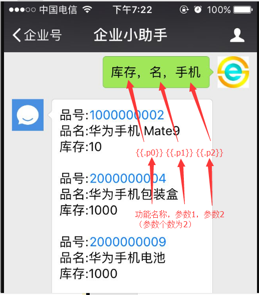

## 参数解释

* 用户的输入(逗号空格分隔)会被解析为`p0，p1，p2...pn`,以及一个特别的`P`(大写)代表所有输入内容

> 例如用户输入：`库存，手机，一号仓` 会被解析为参数组：`p0=库存，p1=手机，p2=一号仓,P=库存，手机，一号仓`

* 在sql中使用`{{.pn}}`作参数替换，如果跟在等号`=`后面作为值替换，可以直接使用:pn，例如：
 
```sql
select 姓名,工号 from {{.p0}} where 姓名=:p1
```

* 要注意的是golang原生模板`{{.pn}}`形式用在文本型值位置应该加上单引号，以免被sql误认为是字段，而`:pn`形式则不需要。

所以上面的语句等价于： 
```sql
select 姓名,工号 from {{.p0}} where 姓名='{{.p1}}'
```

!> 微信查询使用的必要前提是会`sql`，请自行学习！

## 数据字典
微信查询主要扫描`esap_cx`表，对应字段解析如下：

|字段|描述|必填|备注|
|:----:|:--:|:--:|:----|
|mKey|微信自定义菜单id|否|绑定菜单id|
|name|查询名称|是|绑定查询第一个关键字|
|entermsg|进入提醒|否|可以是一个select语句|
|tmpl|sql模板|是||
|aclUser|用户权限|否|@all代表全体可用|
|aclDept|部门权限|否|逗号隔开多个ID或名称|
|aclTag|标签权限|否|逗号隔开多个ID或名称|
|aclApp|应用权限|是|逗号(小写)隔开多个配置应用名或用@all|
|mode|模式|否|1代表仅返回图片或附件|
|nextFn|下一步|否|下一步任意输入必然执行指定查询|
|app|专用查询|否|绑定一个配置的应用名,即专用查询|
|db|数据库名称|否|跨账套|
|url|文章URL|否|有值时返回文章，可使用{\{.pn\}}参数|
|pic|文章封面图片|否||
|safe|保密消息模式|否|1表示保密|
|id|自增编号|否|唯一|

* sql模板位置：`sql/esap/wxcx.get`

## 模板语法
* 支持`golang`模板语法，函数，可实现动态参数和动态sql

**[点击这里参考更多用法](https://app.esap.vip/admin#/wxcx)**

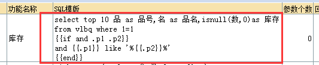

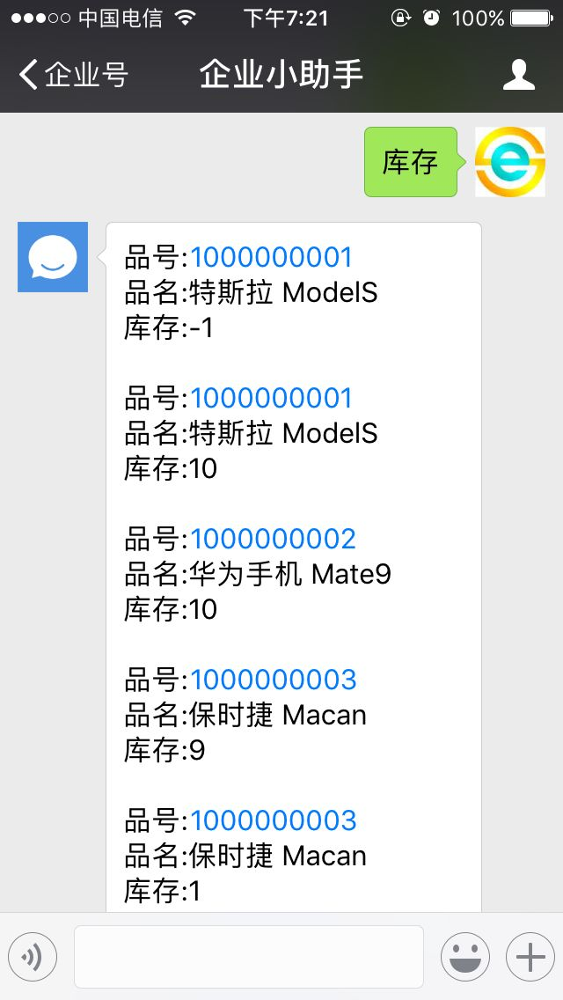

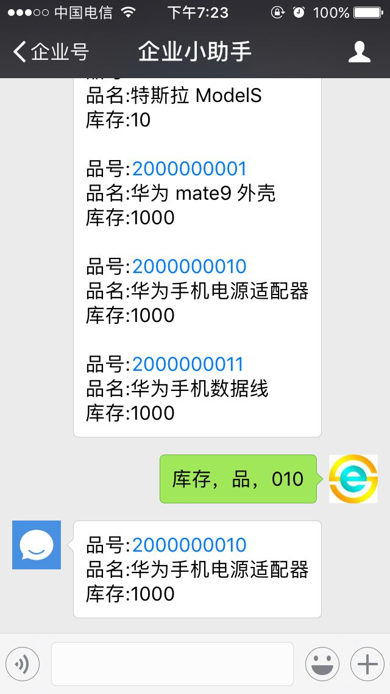

## 模板特性

#### 多重查询
* 可以写`多个select`语句，这些语句结果都能返回（sql2005+）。

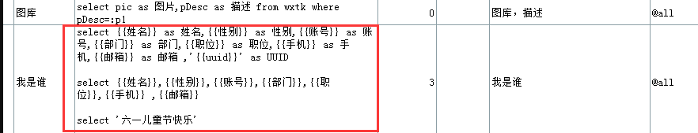
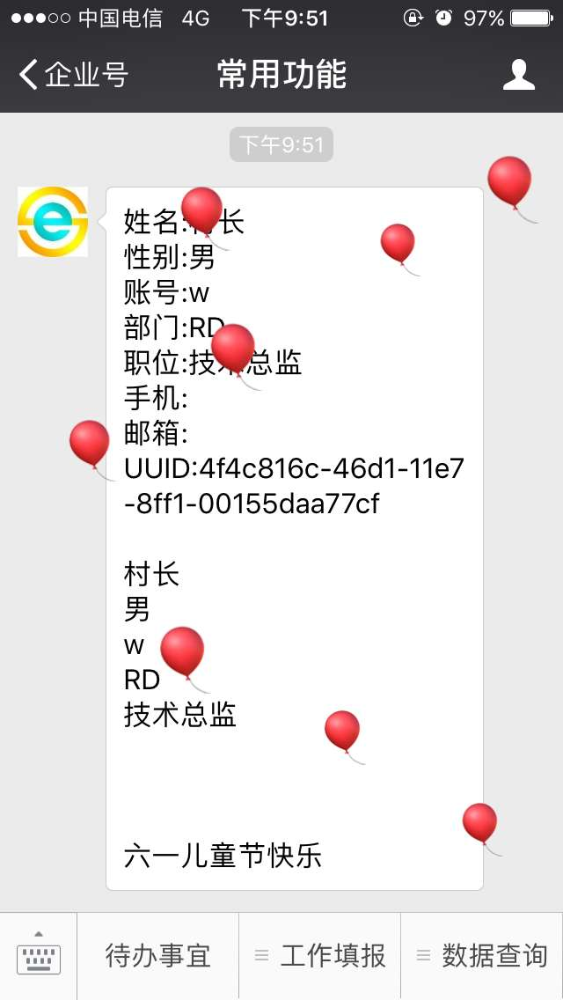 

#### UUID
* `{{uuid}}` 对应一个全球唯一的id, 可用于构建自动编号。

#### 企业号通讯录变量
* `{{姓名}}` 对应 `姓名`
* `{{账号}}` 对应 `账号`
* `{{部门}}` 对应 `部门`
* `{{职位}}` 对应 `职位`
* `{{性别}}` 对应 `性别`
* `{{手机}}` 对应 `手机号`
* `{{邮箱}}` 对应 `邮箱`
* `{{别名}}` 对应 `别名`

#### 更新数据
> sql中使用update或insert，`必须有一句select语句`可返回信息提示用户，例如：

```sql
insert xxx(...) values(...)
...
select N'你的信息已成功提交，谢谢使用'
```

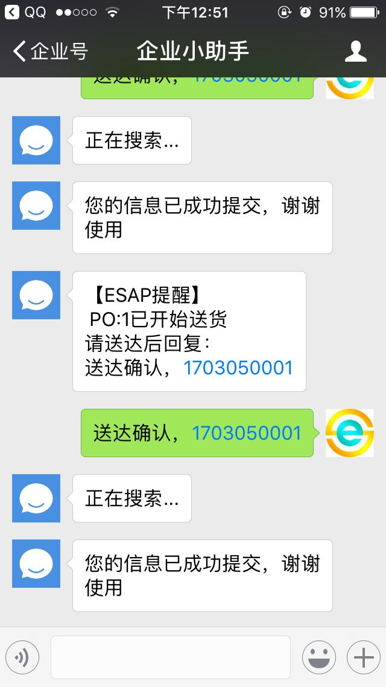

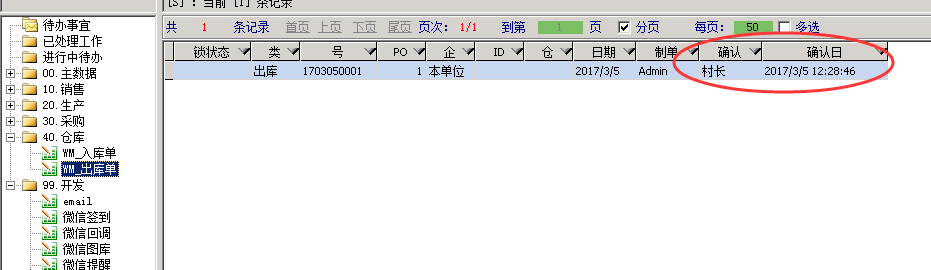

## 多重权限
用`逗号`隔开，可用`【姓名】，【账号】，【部门】，【应用】`随意组合。

## 进入提示
* `esap.yml`配置`entermsg=true`

* 企业号应用回调勾选`上报进入应用事件`

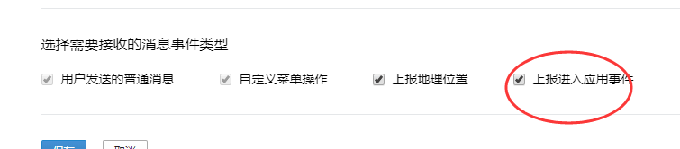 

* `esap_cx`表中的`entermsg`可写`select`来作为进入提醒。

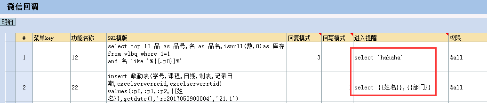 

## 语音查询


 
## 文章返回
* `url`有值时触发,`url`可使用参数`{{.pn}}`。

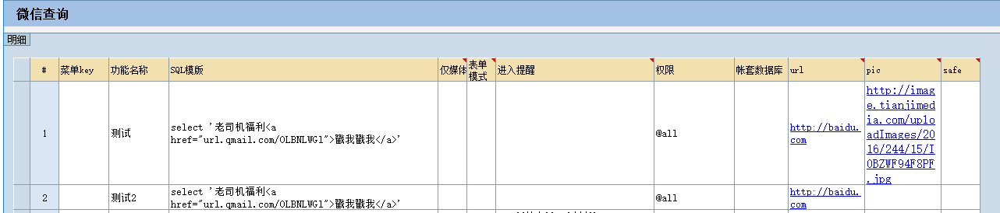


## 扫码查询
二维码或其他条码等,`esap_cx`表中的`mkey`与自定义菜单的`扫码弹框菜单ID`对应即可

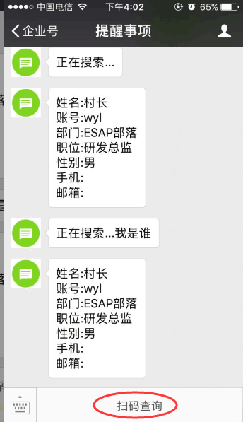

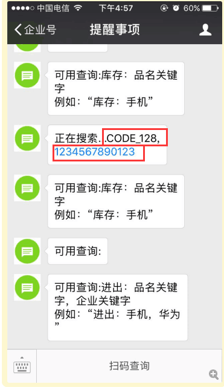

## 多媒体查询
* sql结果`字段`或`别名`为：
 * `pic`或`图片`
 * `files`或`附件`
 * `voice`或`语音`
 * `video`或`视频`

* 支持返回多个`图片`或`附件`

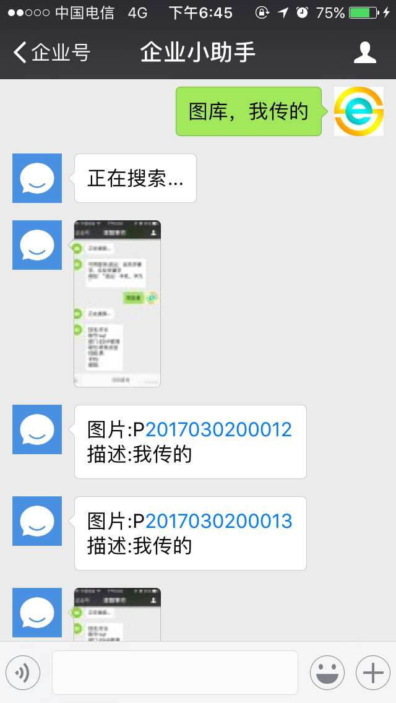
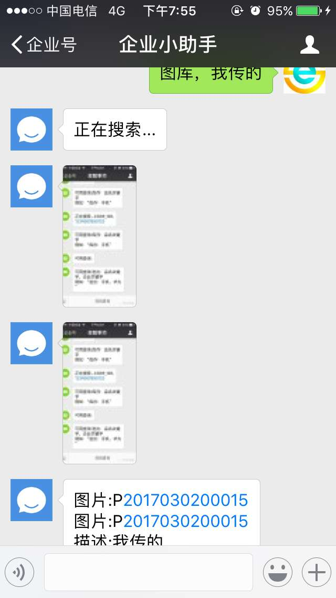


!> 注意微信限制：图片一般不能超过2M,附件不超过20M

## 专用查询
* 专用查询字段(app)为配置的某应用名`appName`，查询不再需要关键字引导，该应用也不再响应其他关键字，仅需输入参数就可查询。

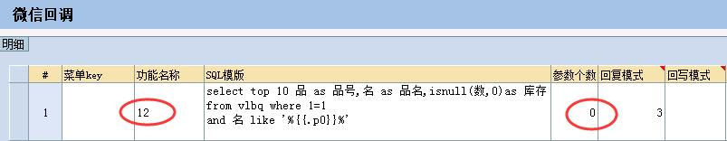
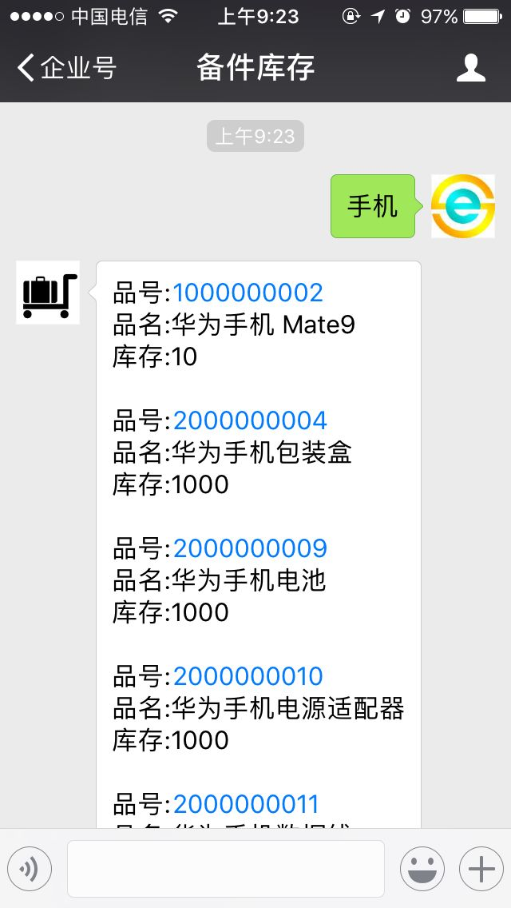

* 专用查询可直接扫二维码秒查。

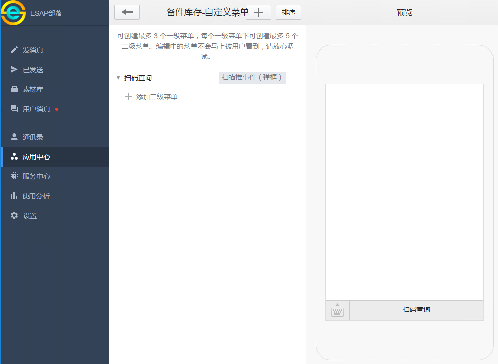
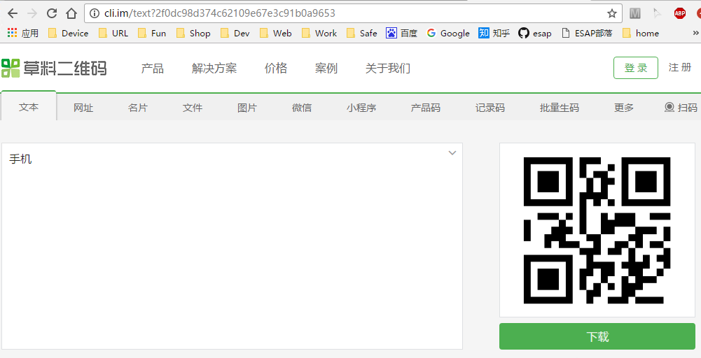
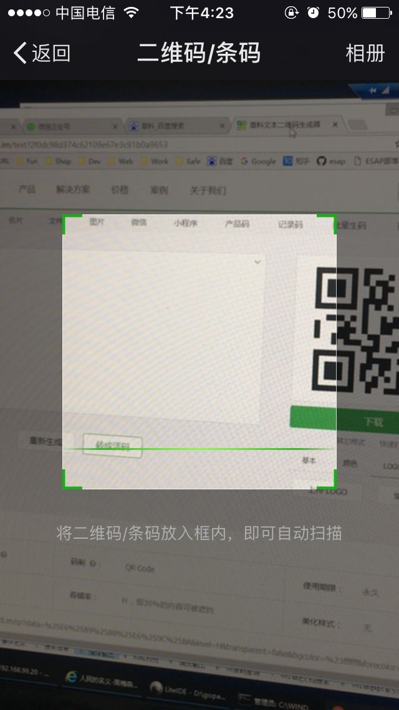
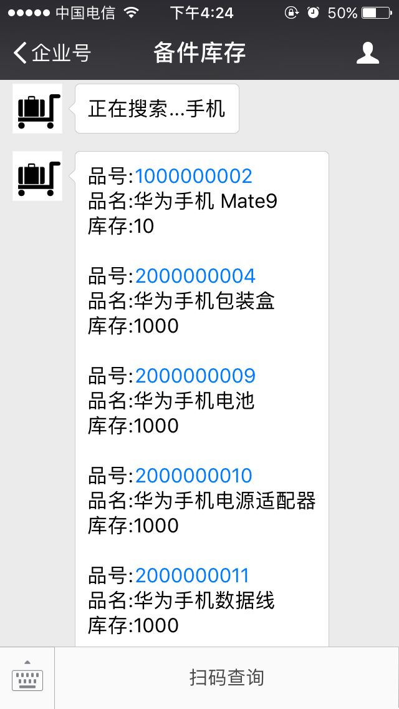

## 菜单查询
设置`mkey`，与企业号应用自定义菜单ID一致。

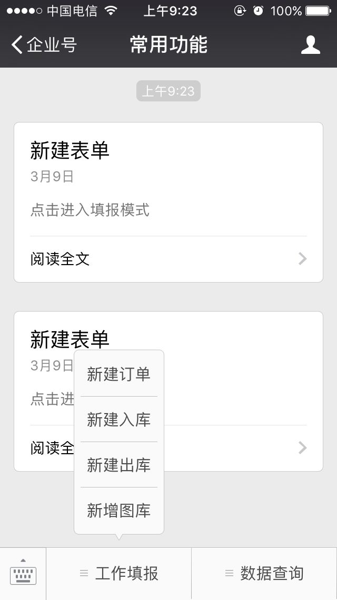
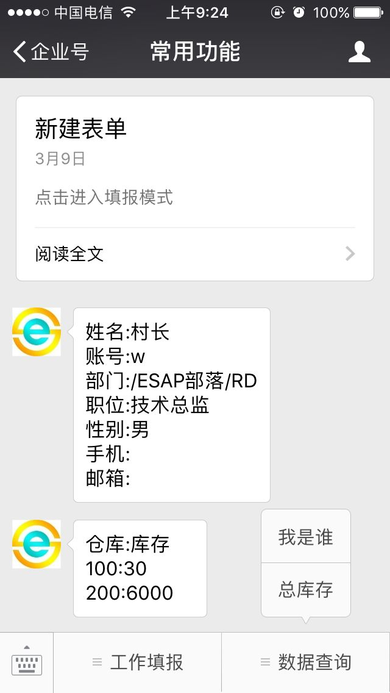

## 连续查询<span style="color:red">(new)</span>
设置`下一步`字段，接下来的输入必然执行该查询，可`多级连续`。

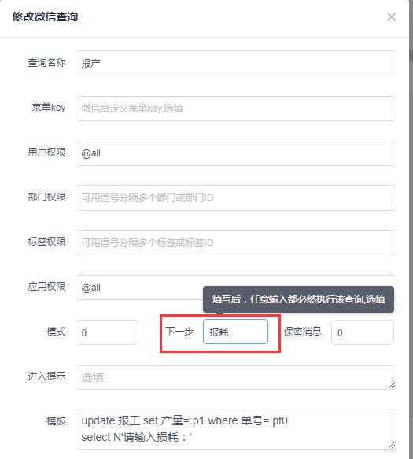
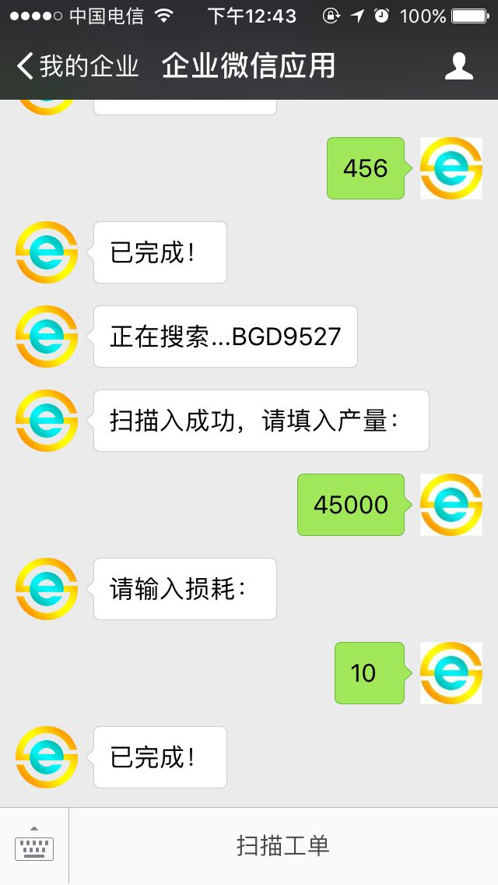

* 第一个发起的查询的参数在连续查询中解析为`pf0，pf1，pf2...`

* 上一次查询的参数在连续查询中解析为`pp0，pp1，pp2...`