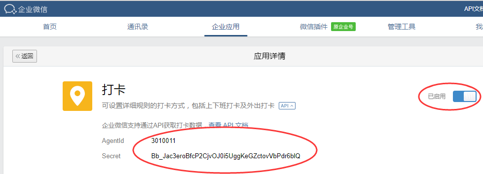
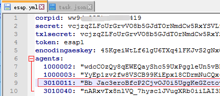
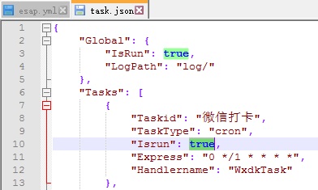
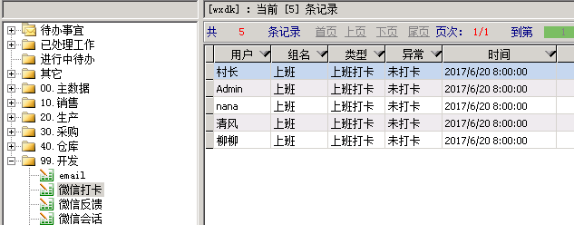

# 微信打卡
* 【微信打卡】同步计划可将微信打卡内容存入本地数据库，并建立`ESAP_打卡`表单，该功能默认不开启。

## 开启企业微信打卡
* 登陆进入`企业微信`-`企业应用`-`打卡`，记录下`AgentId`和`Secret`。

## 配置esap打卡应用
* 填入上面的应用`AgentId`和`Secret`。

## 开启打卡同步计划
* 默认周期为3分钟，便于调试，生产环境建议周期40分钟。

* 保存重启esap，打卡记录就会同步到ES的`ESAP_打卡`模板了。

> 注意，微信数据更新可能会有延迟，延迟一般不超过10分钟。
