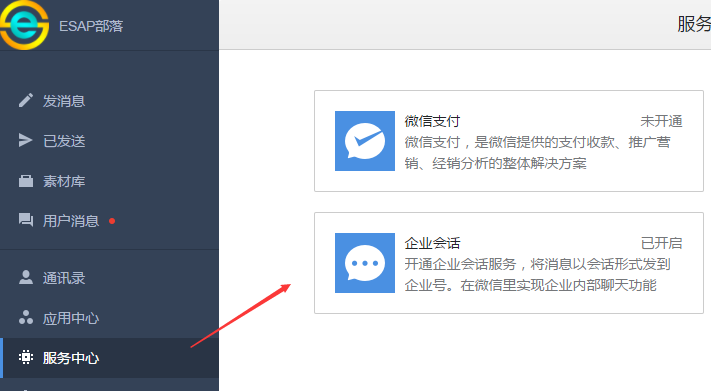
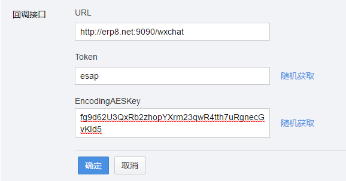
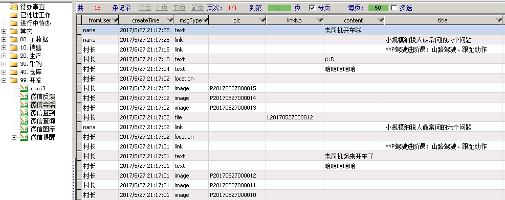

# 微信会话
**此功能在企业微信中已移除**
* 2.8版开始，新增微信会话回调接口，现在你可以轻松快乐的把企业号会话(群聊)记录存储到ES系统了。

## 开启会话
* 登陆【企业号】-【服务中心】，开启【企业会话】

* 设置回调接口，参数与小助手一样，URL填写/wxchat接口

* 接下来就可以进入微信，创建会话，快乐群聊了。

* 群聊消息都将存入ES微信会话，包括文件和图片哦。

