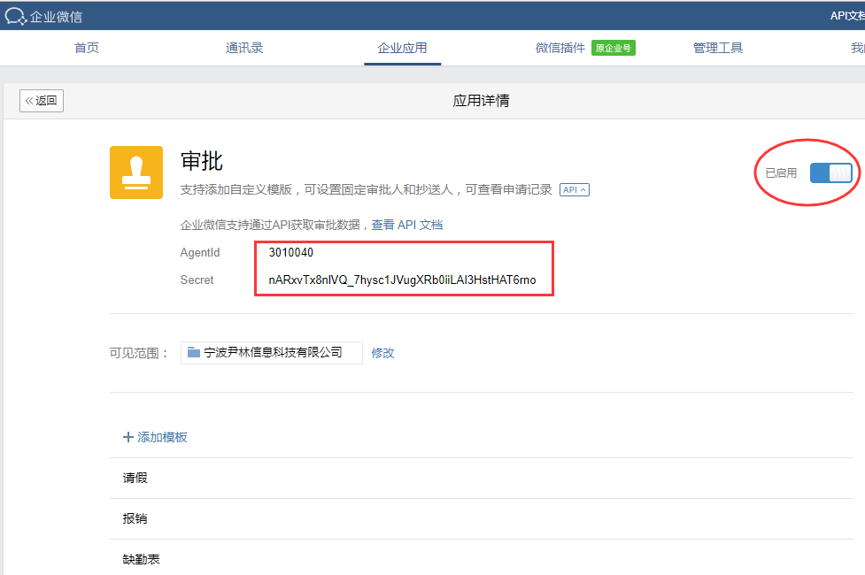
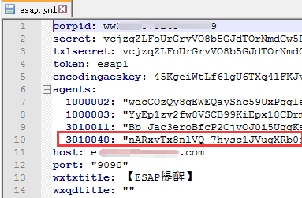
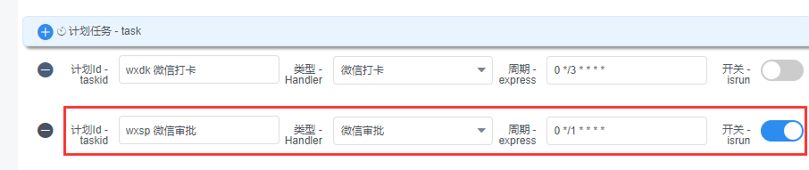
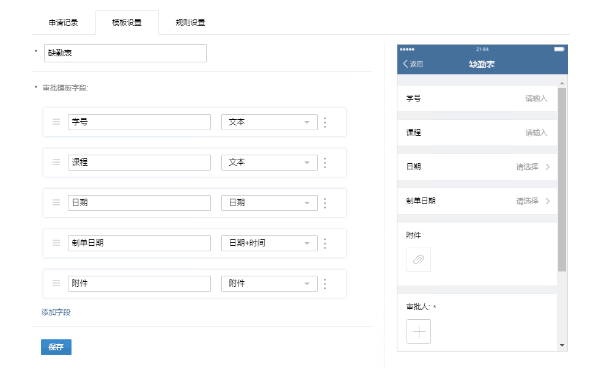
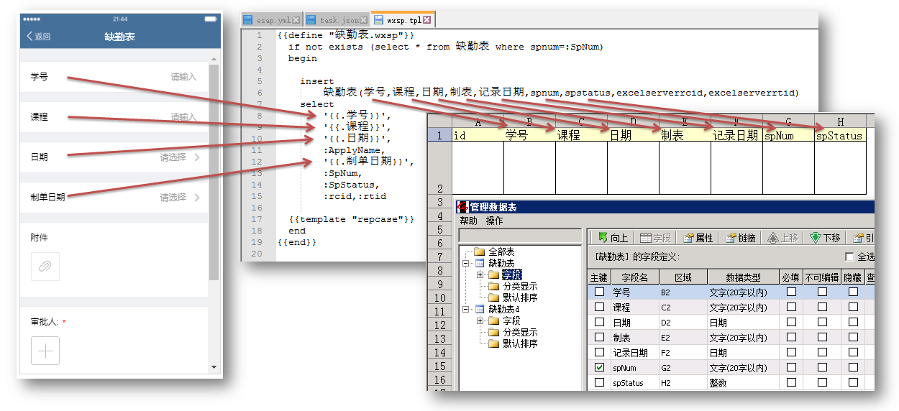
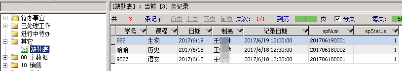

# 微信审批
【微信审批】同步计划可将微信OA审批内容直接存入本地数据库，并且支持自定义模板，该功能默认不开启。

## 开启企业微信审批
* 登陆进入`企业微信`-`企业应用`-`审批`，记录下`AgentId`和`Secret`。



## 配置审批应用
* 填入上面的应用`AgentId`和`Secret`。



## 开启审批同步计划
* 默认周期为1分钟，便于调试，生产环境建议周期5分钟。



* 重启esap,请假和报销审批记录就会同步到ES的`请假`，`报销`模板了。

## 微信审批系统变量
```js
Spname          // 审批名称(请假，报销，自定义审批名称)
ApplyName       // 申请人姓名
ApplyOrg        // 申请人部门
ApprovalName    // 审批人姓名
NotifyName      // 抄送人姓名
SpStatus        // 审批状态：1审批中；2 已通过；3已驳回；4已取消
SpNum           // 审批单号
Leave           // 请假类型
Expense         // 报销类型
```

## *自定义审批同步<span style="color:red">(高级)</span>
* esap允许用户将自定义审批模板数据同步到本地，并实现ES表单新建。

#### 具体实现步骤

* (1) 在企业微信定义一个审批模板，例如`缺勤表`。



* (2) 在ES中也建立一个`同名模板`，用于存放记录。


* (3) 建立`sql/esap/my_wxsp.post`文件，使用`notepad++`修改，定义名为`缺勤表.wxsp`的sql模板，用来下载记录，注意`.wxsp`后缀是必须的。



* (4) 下载效果图



#### SQL模板注释
```sql
{{define "缺勤表.wxsp"}} --定义sql模板【缺勤表.wxsp】
  if not exists (select * from 缺勤表 where spnum=:SpNum)   --检查审批流水号SpNum是否存在，SpNum是`微信审批`系统变量
  begin
	insert
		缺勤表(学号,课程,日期,制表,记录日期,spnum,spstatus,excelserverrcid,excelserverrtid)  --插入主表记录
	select
		'{{.学号}}',   --对应企业微信的学号，以下带花括号的变量同理
		'{{.课程}}',
		'{{.日期}}',
		:ApplyName,   --申请人姓名，微信审批系统变量
		'{{.制单日期}}',
		:SpNum,       --审批编号，微信审批系统变量
		:SpStatus,    --审批状态，微信审批系统变量
		:rcid,:rtid   --rcid,rtid，esap系统变量
  {{template "repcase"}}    --插入Es_repcase记录，用于ES工作台显示
  end
{{end}}
```

> 关于sql模板的更多内容请阅读[SQL模板章节](/sqltpl.md)
