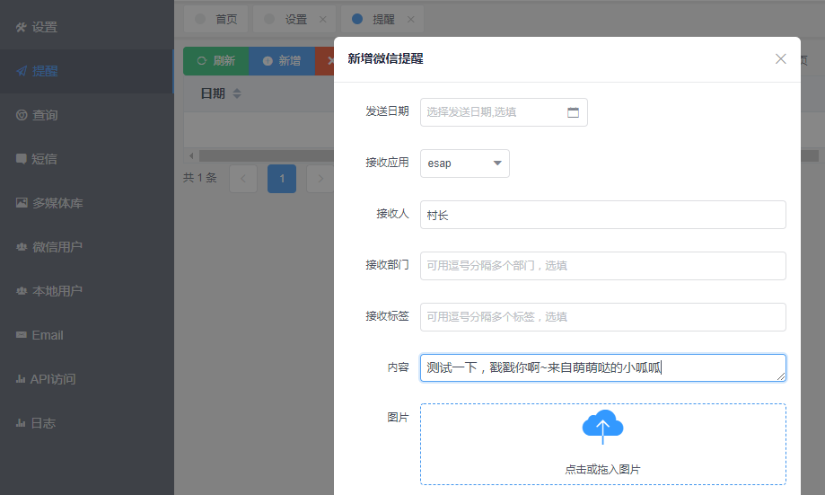
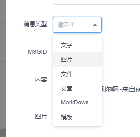
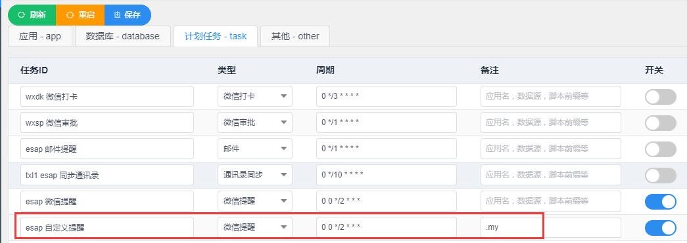

# 微信提醒

## 开启提醒

* 配置计划任务，开启`微信提醒`。

## 创建提醒

* 新建一条`esap_提醒`记录，也可以在ES中回写新建，类似这样：

* 最迟两分钟后，你将收到来自企业微信的提醒消息。

## 发给全体

接收人字段填`@all`即可

## 发给用户组（角色）

接收人、接收部门、接收标签填`逗号`隔开的多个ID或名称

## 图片或文件消息

选择对应的消息类型即可

!> 需要开启网盘，ESAP在网盘服务器上运行，或将网盘目录映射到本地。

## 密图文消息

!> 注意：微信限制了密图文消息，每天仅100条。

## 普通图文消息

## 数据字典

微信提醒实际是定期扫描`esap_tx`表，对应字段解析如下：

|字段|描述|必填|备注|
|:----:|:--:|:--:|:----|
|app|接收应用|是|配置中的应用名，例如`esap`|
|cDate|创建日期|否|可设置较晚时间以延迟发送|
|flag|是否发送标识|否|1表示已发送|
|toUser|接收人|是|用户ID或姓名，逗号隔开多个,使用@all表示全体|
|toParty|接收部门|否|部门ID或名称，逗号隔开多个|
|toTag|接收标签|否|标签ID或名称，逗号隔开多个|
|msgtype|消息类型|否|不填默认为文本消息，可选template/news/mpnews/textcard/image/file/voice/video/markdown|
|msgid|消息id|否|一般为模板消息ID,服务号支持|
|content|文字消息内容|否|企业微信可使用br或a标签|
|pic|图片|否|发图片消息时必填|
|fh|附件|否|发附件消息时必填|
|safe|保密消息模式|否|1表示保密|
|title|消息标题|否|视频，卡片，新闻类消息使用|
|url|消息链接|否|视频，卡片，新闻类消息使用|
|description|消息描述|否|视频，卡片，新闻类消息使用|
|ret|消息发送结果|否|发送成功时为ok|
|id|自增编号|否| |

## *自定义提醒(高级)

提醒查询sql模板位置：`sql/sys/wxtx.get`, 默认使用`top 1000`防止API超限。

提醒成功后的回调sql模板位置：`sql/sys/wxtx.put`。

sql模板加入后缀进行自定义，具体步骤：

* 自建sql模板文件，例如建立`sql/sys/mytx.get`和`sql/sys/mytx.put`

* 参考原模板，定义新sql模板，例如`mytx.get`文件中定义`wxtx.my`，`mytx.put`文件中定义`wxtx.my`，输出字段与原模板一致。

* 在计划任务中新增一个提醒任务，备注中填入`.my`，完成后保存重启。

* 新提醒任务会使用wxtx.my等新脚本进行提醒扫描，可实现基于自定义表的自定义提醒。

* 特殊的，`ES提醒`使用`.es`后缀。
