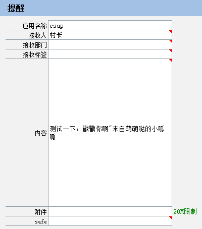

# 微信提醒

* [开启提醒计划](#开启提醒计划)
* [创建提醒消息](#创建提醒消息)
* [发消息给全体](#发消息给全体)
* [发消息给用户组](#发消息给用户组)
* [发图片或文件消息](#发图片或文件消息)
* [发密图文消息](#发密图文消息)
* [发普通图文消息](#发普通图文消息)
* [发保密消息](#发保密消息)
* [发待办提醒](#发待办提醒)
* [*数据字典](#数据字典)
* [*其他事项](#其他事项)

## 开启提醒计划

* 在admin模块中配置计划任务，开启`微信提醒`。


## 创建提醒消息

* 在ES中新建一条【微信提醒】记录，也可以回写新建，例如像这样：



* 最迟两分钟后，你将收到来自微信企业号的提醒内容。


> 通过设置`cDate`可推迟消息的发送，`content`可以包含换行`br`和超链接`a`标签。

## 发消息给全体
接收人字段填`@all`即可

## 发消息给用户组
接收人、接受部门、接受标签填逗号隔开的多个ID或名称

## 发图片或文件消息
当图片(`pic`)字段或附件`fh`)字段 **有值** 时，系统自动发送。


> 需要在网盘所在服务器上运行，或将网盘根目录映射到本地(盘符一致)。

## 发密图文消息
当esap_txd表中有值时自动发送，`pic`，`title`，`content`字段必填。


> 注意：微信限制了密图文消息，每天仅100条。

## 发普通图文消息
当esap_txd表`pic`字段无值，`title`，`digest`,`content`,`url`字段有值时自动降级为普通图文消息。


> 此时内容为图片链接，如果内容(content)无值，则消息降级为带链接跳转的普通文字消息。

## 发保密消息
当esap_tx表的safe=1时自动发送。


> 保密消息只是相对的，请勿过于依赖。

## 发待办提醒
* 在ES系统的ES_Witodo表上加上下列触发器即可

* 注意，**`ES系统用户名和账号要跟企业号通讯录的姓名账号一致`**

```sql
USE [esap] --改成你自己的数据库
GO
-- =============================================
-- Author:        woylin
-- Create date:   2017-8-28
-- Description:   esap3.0
-- =============================================
IF  EXISTS (SELECT * FROM sys.objects 
WHERE object_id = OBJECT_ID(N'tWxtx') AND type in (N'TR'))
DROP TRIGGER [tWxtx]
GO
CREATE TRIGGER [dbo].[tWxtx] 
   ON [dbo].[ES_Witodo] 
   AFTER INSERT
AS 
BEGIN    
    SET NOCOUNT ON;    
    insert esap_tx(cdate, toUser, content) 
    select getdate(), UserName, f.pName + wiDesc
    from ES_WorkItem wi, ES_User u, inserted i, ES_WfTask t,ES_WorkFlow f
    where wi.wiId=i.wiId and i.userId=u.UserId and wi.tId=t.tId and t.pId=f.pId
    and isnull(wi.wiDesc,'')<>'' and ISNULL(wi.state1,0)<>1
END
```

效果图：


企业微信效果图：


## 数据字典
微信提醒实际是定期扫描`esap_tx`表，对应字段解析如下：

|字段|描述|必填|备注|
|:----:|:--:|:--:|:----|
|app|接收应用|是|配置中的应用名，例如`esap`|
|cDate|创建日期|否|可设置较晚时间以延迟发送|
|flag|是否发送标识|否|1表示已发送|
|toUser|接收人|是|用户ID或姓名，逗号隔开多个,使用@all表示全体|
|toParty|接收部门|是|部门ID或名称，逗号隔开多个|
|toTag|接收标签|是|标签ID或名称，逗号隔开多个|
|content|文字消息内容|否|企业微信可使用br或a标签|
|id|自增编号|否| |
|pic|图片|否|存在时，发图片消息|
|fh|附件|否|存在时，发附件消息|
|ret|消息发送结果|否|发送成功时为ok|
|excelserverrcid|ES表单系统编号|是|用于关联esap_txd表|
|safe|保密消息模式|否|1表示保密|
|db|数据源名称|否|配置中的数据源名称，跨账套时使用|
|title|卡片消息标题|否|仅企业微信端支持|
|url|卡片消息链接|否|仅企业微信端支持|

## 其他事项
sql模板位置：sql/esap/wxtx.get, 默认使用`top 1000`防止误操作超限，可自行更改。
