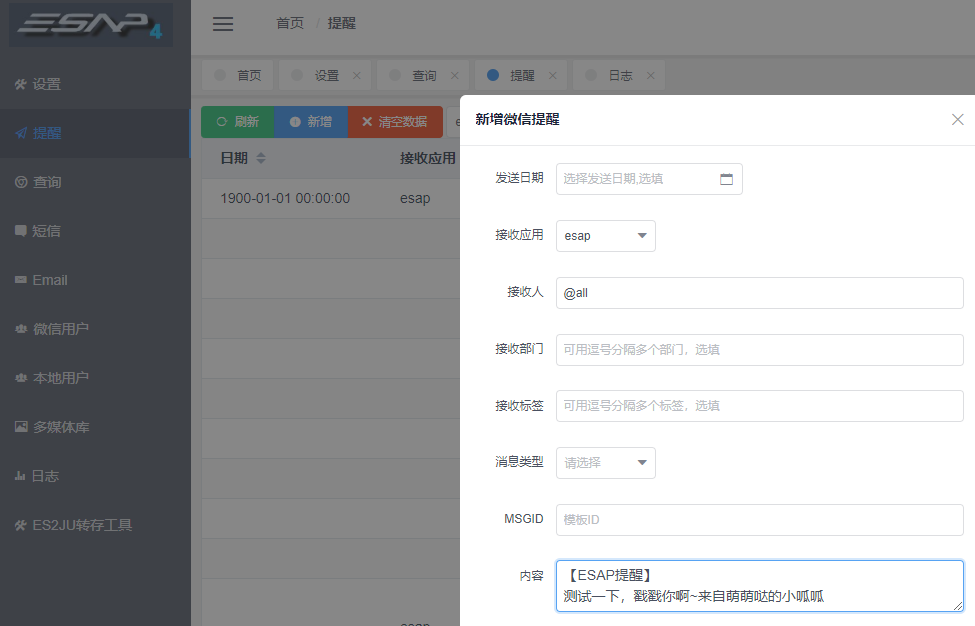

# 微信提醒

* [开启提醒](#开启提醒)
* [创建提醒](#创建提醒)
* [发给全体](#发给全体)
* [发给用户组](#发给用户组)
* [图片或文件消息](#图片或文件消息)
* [密图文消息](#密图文消息)
* [普通图文消息](#普通图文消息)
* [保密消息](#保密消息)
* [待办提醒](#待办提醒)
* [*数据字典](#数据字典)
* [*自定义提醒](#*自定义提醒[高级教程])

## 开启提醒

* 配置计划任务，开启`微信提醒`。

## 创建提醒

* 新建一条【提醒】记录，也可以在ES中回写新建，类似这样：

* 最迟两分钟后，你将收到来自企业微信的提醒消息。

> 通过设置`发送日期(cDate)`可推迟消息的发送，`内容(content)`可以包含换行`br`和超链接`a`标签。

## 发给全体
接收人字段填`@all`即可

## 发给用户组
接收人、接收部门、接收标签填逗号隔开的多个ID或名称

## 图片或文件消息
当`图片(pic)`或`附件(fh)`字段 **有值** 时，系统自动发送。

> 需要在网盘所在服务器上运行，或将网盘根目录映射到本地(盘符一致)。

## 密图文消息
当esap_txd表中有值时自动发送，`pic`，`title`，`content`字段必填。

> 注意：微信限制了密图文消息，每天仅100条。

## 普通图文消息
当esap_txd表`pic`字段无值，`title`，`digest`,`content`,`url`字段有值时自动降级为普通图文消息。

> 此时内容为图片链接，如果内容(content)无值，则消息降级为带链接跳转的普通文字消息。

## 保密消息
当esap_tx表的safe=1时自动发送。

> 保密消息只是相对的，请勿过于依赖。

## 待办提醒
* 设置一个【微信提醒】计划任务，例如`esap ES待办提醒`，配置后缀为`.estodo`即可

* 如果是【聚表模式】，配置后缀为`.jutodo`，其他同上。

> 注意，**`系统用户名要跟企业号通讯录的姓名一致`**

效果图：

企业微信效果图：

## 数据字典
微信提醒实际是定期扫描`esap_tx`表，对应字段解析如下：

|字段|描述|必填|备注|
|:----:|:--:|:--:|:----|
|app|接收应用|是|配置中的应用名，例如`esap`|
|cDate|创建日期|否|可设置较晚时间以延迟发送|
|flag|是否发送标识|否|1表示已发送|
|toUser|接收人|是|用户ID或姓名，逗号隔开多个,使用@all表示全体|
|toParty|接收部门|是|部门ID或名称，逗号隔开多个|
|toTag|接收标签|是|标签ID或名称，逗号隔开多个|
|content|文字消息内容|否|企业微信可使用br或a标签|
|id|自增编号|否| |
|pic|图片|否|存在时，发图片消息|
|fh|附件|否|存在时，发附件消息|
|ret|消息发送结果|否|发送成功时为ok|
|rcid|表单编号|是|用于关联esap_txd表|
|safe|保密消息模式|否|1表示保密|
|db|数据源名称|否|配置中的数据源名称，跨账套时使用|
|title|卡片消息标题|否|仅企业微信端支持|
|url|卡片消息链接|否|仅企业微信端支持|

## *自定义提醒[高级教程]
提醒查询sql模板位置：sql/esap/wxtx.get, 默认使用`top 1000`防止API超限。

提醒成功后的回写sql模板位置：sql/esap/wxtx.put。

sql模板可加入后缀，进行自定义，具体步骤：

* 自建sql模板文件，例如建立sql/esap/mytx.get和sql/esap/mytx.put

* 参考原模板，定义新sql模板，例如mytx.get文件中定义`wxtx.my`，`wxtxd.my`，mytx.put文件中定义`wxtx.my`，输出字段与原模板一致。

* 在计划任务中新增一个提醒任务，备注中填入`.my`，完成后保存重启。

* 新提醒任务会使用wxtx.my等新脚本进行提醒扫描，可实现基于自定义表的自定义提醒。

* 特殊的，`聚表模式(JUAP)`使用`.ju`后缀。

